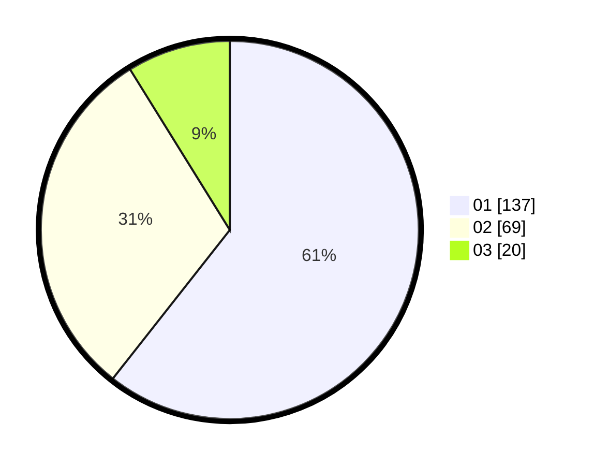

# Hasil

Hasil perolehan suara paslon dapat dilihat pada file paslon-01.txt, paslon-02.txt, dan paslon-03.txt.

Jika tidak ada, artinya data tersebut belum ada pada SIREKAP.

## Perolehan Suara

 * Paslon 01: **137**.
 * Paslon 02: **69**.
 * Paslon 03: **20**.

## Foto C Plano

https://sirekap-obj-formc.kpu.go.id/9d07/pemilu/ppwp/31/73/07/10/06/3173071006034-20240214-193233--9ee595c0-9ac7-401b-8c86-df4b8633dc58.jpg

https://sirekap-obj-formc.kpu.go.id/9d07/pemilu/ppwp/31/73/07/10/06/3173071006034-20240214-193242--24176e7e-102b-492f-b3f3-a8da056ffe23.jpg
