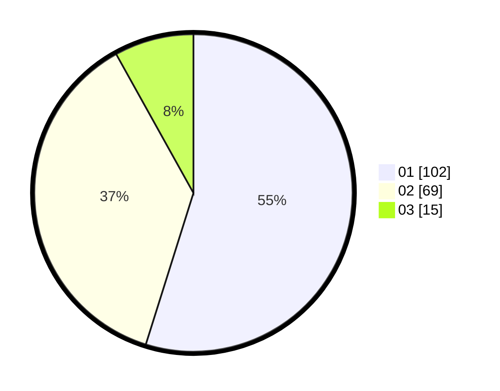

# Hasil

Hasil perolehan suara paslon dapat dilihat pada file paslon-01.txt, paslon-02.txt, dan paslon-03.txt.

Jika tidak ada, artinya data tersebut belum ada pada SIREKAP.

## Perolehan Suara

 * Paslon 01: **102**.
 * Paslon 02: **69**.
 * Paslon 03: **15**.

## Foto C Plano

https://sirekap-obj-formc.kpu.go.id/eb3e/pemilu/ppwp/31/73/07/10/06/3173071006035-20240215-002606--c830305b-8a47-4e3b-82da-5bd4255ce298.jpg

https://sirekap-obj-formc.kpu.go.id/eb3e/pemilu/ppwp/31/73/07/10/06/3173071006035-20240215-002752--f0d4e72f-a2dd-4858-ba70-25d5e5f56cc7.jpg

https://sirekap-obj-formc.kpu.go.id/eb3e/pemilu/ppwp/31/73/07/10/06/3173071006035-20240215-002841--50d7d213-b680-42bf-9d61-6204d9f70261.jpg
