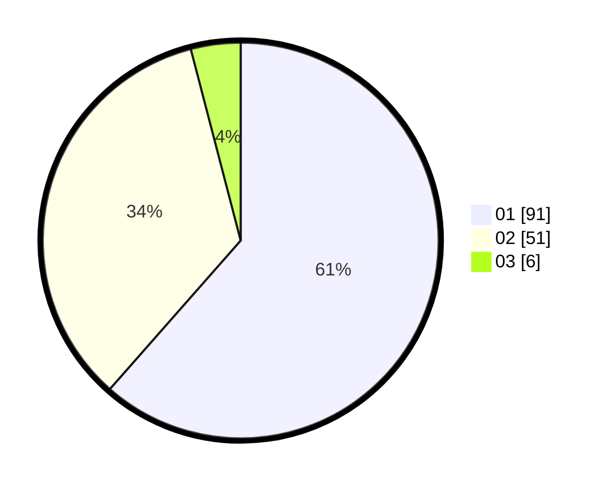

# Hasil

Hasil perolehan suara paslon dapat dilihat pada file paslon-01.txt, paslon-02.txt, dan paslon-03.txt.

Jika tidak ada, artinya data tersebut belum ada pada SIREKAP.

## Perolehan Suara

 * Paslon 01: **91**.
 * Paslon 02: **51**.
 * Paslon 03: **6**.

## Foto C Plano

https://sirekap-obj-formc.kpu.go.id/664b/pemilu/ppwp/31/73/07/10/06/3173071006037-20240214-214916--974da2ee-243a-4e70-b848-06032d141df3.jpg

https://sirekap-obj-formc.kpu.go.id/664b/pemilu/ppwp/31/73/07/10/06/3173071006037-20240214-215111--20fe327f-0480-4f6c-a3ce-4c12fab0fbf8.jpg

https://sirekap-obj-formc.kpu.go.id/664b/pemilu/ppwp/31/73/07/10/06/3173071006037-20240214-215256--2828d433-6b68-4a97-bdd7-e32d0992d847.jpg
