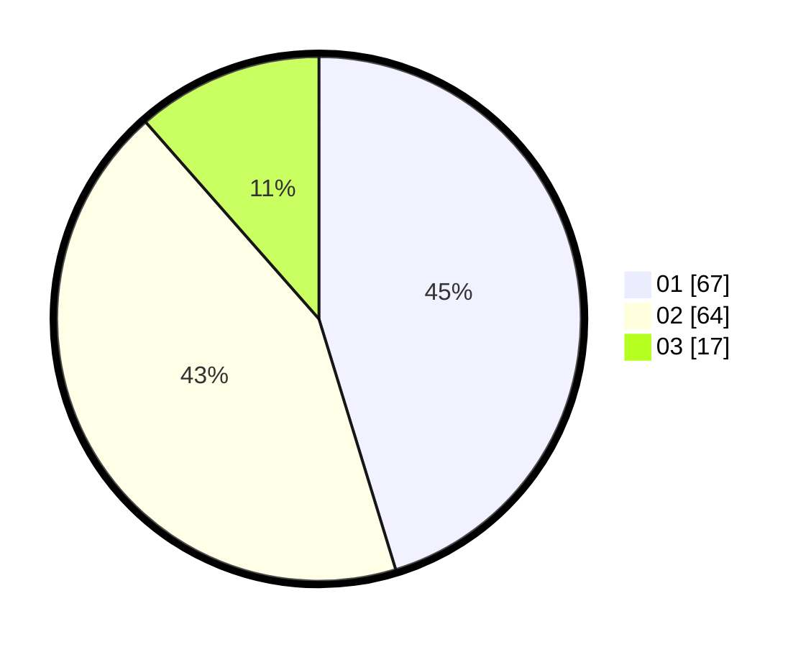

# Hasil

Hasil perolehan suara paslon dapat dilihat pada file paslon-01.txt, paslon-02.txt, dan paslon-03.txt.

Jika tidak ada, artinya data tersebut belum ada pada SIREKAP.

## Perolehan Suara

 * Paslon 01: **67**.
 * Paslon 02: **64**.
 * Paslon 03: **17**.

## Foto C Plano

https://sirekap-obj-formc.kpu.go.id/3693/pemilu/ppwp/31/73/07/10/06/3173071006038-20240214-225210--838a00d5-11d6-47f7-bcb8-459b5b59fd9e.jpg

https://sirekap-obj-formc.kpu.go.id/3693/pemilu/ppwp/31/73/07/10/06/3173071006038-20240214-225410--a3412200-1218-4a55-b353-56db34af815a.jpg

https://sirekap-obj-formc.kpu.go.id/3693/pemilu/ppwp/31/73/07/10/06/3173071006038-20240214-225516--d1b63261-bced-4983-b38b-3a320aaf08cb.jpg
