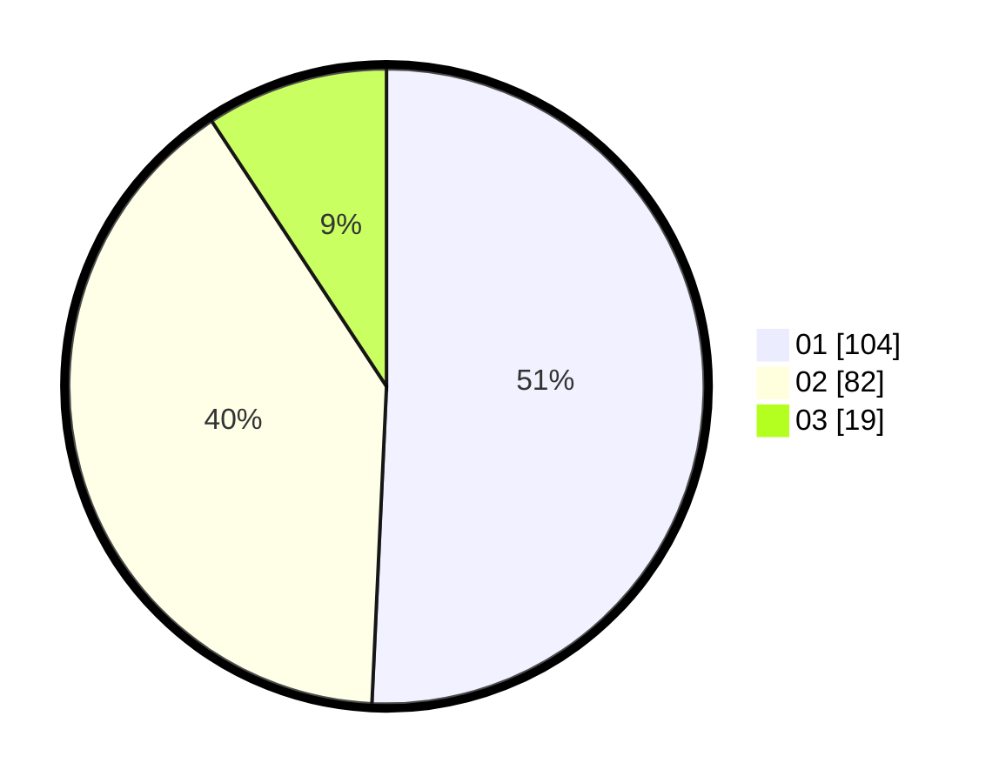

# Hasil

Hasil perolehan suara paslon dapat dilihat pada file paslon-01.txt, paslon-02.txt, dan paslon-03.txt.

Jika tidak ada, artinya data tersebut belum ada pada SIREKAP.

## Perolehan Suara

 * Paslon 01: **104**.
 * Paslon 02: **82**.
 * Paslon 03: **19**.

## Foto C Plano

https://sirekap-obj-formc.kpu.go.id/4694/pemilu/ppwp/31/73/07/10/06/3173071006041-20240214-155416--5c14f97b-40cf-485e-af30-835be6d1e2d4.jpg

https://sirekap-obj-formc.kpu.go.id/4694/pemilu/ppwp/31/73/07/10/06/3173071006041-20240214-185237--bbf9abcf-b24e-4ab8-ae99-44ee08631bcb.jpg

https://sirekap-obj-formc.kpu.go.id/4694/pemilu/ppwp/31/73/07/10/06/3173071006041-20240214-155545--9eb419ac-a1d8-4090-ac0e-7b6dec7abec8.jpg

## DATA PEMILIH TETAP

Jumlah pemilih dalam DPT: **271**.
 * L: **146**.
 * P: **125**.

## DATA PENGGUNA HAK PILIH

Jumlah pengguna hak pilih dalam DPT: **204**.
 * L: **103**.
 * P: **101**.

Jumlah pengguna hak pilih dalam DPTb: **2**.
 * L: **1**.
 * P: **1**.

Jumlah pengguna hak pilih dalam DPK: **3**.
 * L: **3**.
 * P: **0**.

Jumlah pengguna hak pilih: **209**.
 * L: **107**.
 * P: **102**.

## JUMLAH SUARA SAH DAN TIDAK SAH

JUMLAH SELURUH SUARA SAH: **205**.

JUMLAH SUARA TIDAK SAH: **4**.

JUMLAH SELURUH SUARA SAH DAN SUARA TIDAK SAH: **209**.
