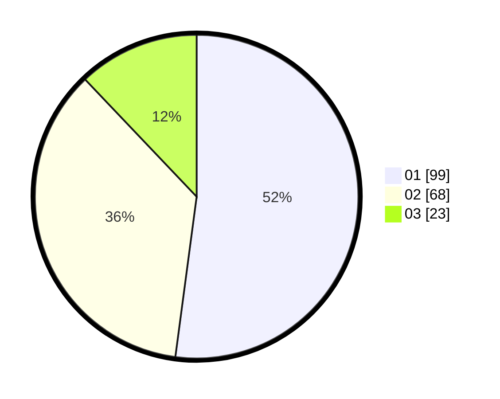

# Hasil

Hasil perolehan suara paslon dapat dilihat pada file paslon-01.txt, paslon-02.txt, dan paslon-03.txt.

Jika tidak ada, artinya data tersebut belum ada pada SIREKAP.

## Perolehan Suara

 * Paslon 01: **99**.
 * Paslon 02: **68**.
 * Paslon 03: **23**.

## Foto C Plano

https://sirekap-obj-formc.kpu.go.id/a050/pemilu/ppwp/31/73/07/10/06/3173071006042-20240216-015933--c301c4b1-064b-4597-b50f-0a079698bb8f.jpg

https://sirekap-obj-formc.kpu.go.id/a050/pemilu/ppwp/31/73/07/10/06/3173071006042-20240216-015935--2e47ea74-4dfc-4792-b6ab-b2cbaffc06cb.jpg

https://sirekap-obj-formc.kpu.go.id/a050/pemilu/ppwp/31/73/07/10/06/3173071006042-20240216-015934--144152bb-134a-4fa2-9e97-bfd8c5fc978f.jpg

## DATA PEMILIH TETAP

Jumlah pemilih dalam DPT: **283**.
 * L: **139**.
 * P: **144**.

## DATA PENGGUNA HAK PILIH

Jumlah pengguna hak pilih dalam DPT: **191**.
 * L: **95**.
 * P: **96**.

Jumlah pengguna hak pilih dalam DPTb: **0**.
 * L: **0**.
 * P: **0**.

Jumlah pengguna hak pilih dalam DPK: **0**.
 * L: **0**.
 * P: **0**.

Jumlah pengguna hak pilih: **192**.
 * L: **95**.
 * P: **97**.

## JUMLAH SUARA SAH DAN TIDAK SAH

JUMLAH SELURUH SUARA SAH: **190**.

JUMLAH SUARA TIDAK SAH: **2**.

JUMLAH SELURUH SUARA SAH DAN SUARA TIDAK SAH: **192**.
