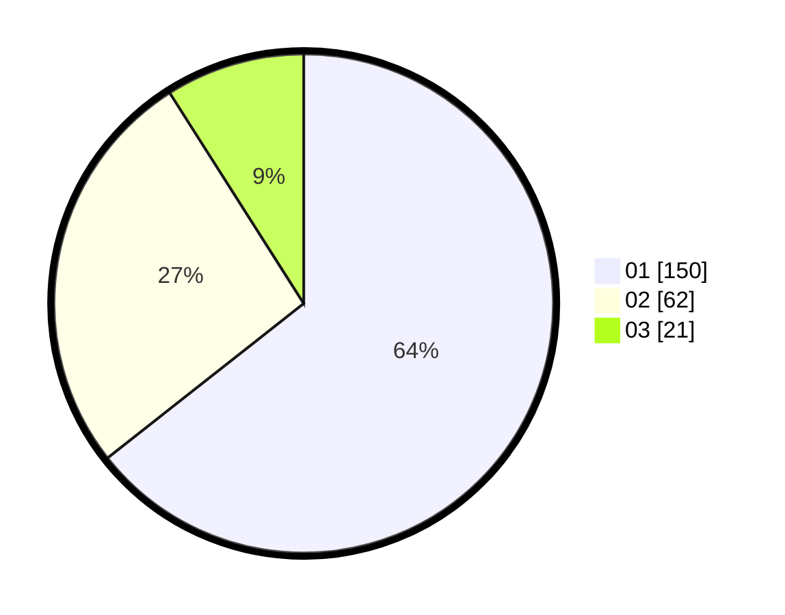

# Hasil

Hasil perolehan suara paslon dapat dilihat pada file paslon-01.txt, paslon-02.txt, dan paslon-03.txt.

Jika tidak ada, artinya data tersebut belum ada pada SIREKAP.

## Perolehan Suara

 * Paslon 01: **150**.
 * Paslon 02: **62**.
 * Paslon 03: **21**.

## Foto C Plano

https://sirekap-obj-formc.kpu.go.id/6392/pemilu/ppwp/31/73/07/10/06/3173071006044-20240214-201515--56587da6-7aed-4503-af29-2f902f916312.jpg

https://sirekap-obj-formc.kpu.go.id/6392/pemilu/ppwp/31/73/07/10/06/3173071006044-20240214-201611--2312ac51-5121-46b0-8914-1fdff5f5f352.jpg

https://sirekap-obj-formc.kpu.go.id/6392/pemilu/ppwp/31/73/07/10/06/3173071006044-20240214-201644--3026212b-4c39-4401-a7dc-957784d02267.jpg

## DATA PEMILIH TETAP

Jumlah pemilih dalam DPT: **278**.
 * L: **142**.
 * P: **136**.

## DATA PENGGUNA HAK PILIH

Jumlah pengguna hak pilih dalam DPT: **228**.
 * L: **113**.
 * P: **118**.

Jumlah pengguna hak pilih dalam DPTb: **6**.
 * L: **2**.
 * P: **4**.

Jumlah pengguna hak pilih dalam DPK: **2**.
 * L: **1**.
 * P: **1**.

Jumlah pengguna hak pilih: **236**.
 * L: **116**.
 * P: **120**.

## JUMLAH SUARA SAH DAN TIDAK SAH

JUMLAH SELURUH SUARA SAH: **233**.

JUMLAH SUARA TIDAK SAH: **3**.

JUMLAH SELURUH SUARA SAH DAN SUARA TIDAK SAH: **236**.
