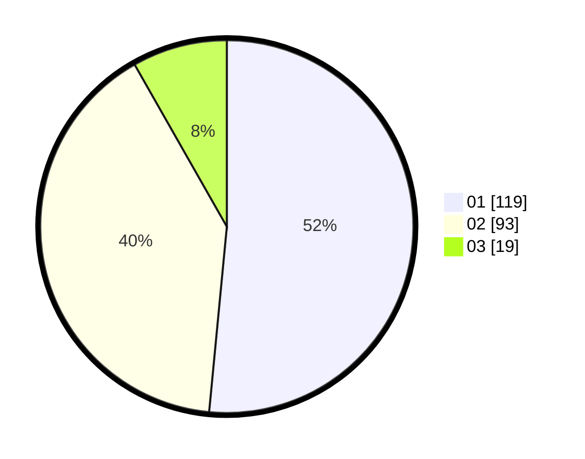

# Hasil

Hasil perolehan suara paslon dapat dilihat pada file paslon-01.txt, paslon-02.txt, dan paslon-03.txt.

Jika tidak ada, artinya data tersebut belum ada pada SIREKAP.

## Perolehan Suara

 * Paslon 01: **119**.
 * Paslon 02: **93**.
 * Paslon 03: **19**.

## Foto C Plano

https://sirekap-obj-formc.kpu.go.id/f035/pemilu/ppwp/31/73/07/10/06/3173071006047-20240215-031128--2cb23b15-7f07-4e0a-8c25-55b8f71aa314.jpg

https://sirekap-obj-formc.kpu.go.id/f035/pemilu/ppwp/31/73/07/10/06/3173071006047-20240215-031810--7aa6b848-d88a-4f31-955f-0f73ac242de6.jpg

https://sirekap-obj-formc.kpu.go.id/f035/pemilu/ppwp/31/73/07/10/06/3173071006047-20240215-031920--6c1f8a7b-9f11-409a-a9b0-a59614c5aca6.jpg
