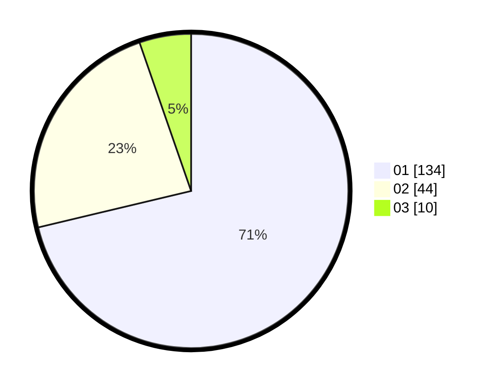

# Hasil

Hasil perolehan suara paslon dapat dilihat pada file paslon-01.txt, paslon-02.txt, dan paslon-03.txt.

Jika tidak ada, artinya data tersebut belum ada pada SIREKAP.

## Perolehan Suara

 * Paslon 01: **134**.
 * Paslon 02: **44**.
 * Paslon 03: **10**.

## Foto C Plano

https://sirekap-obj-formc.kpu.go.id/0326/pemilu/ppwp/31/73/07/10/06/3173071006057-20240214-203418--2fdd8e18-939f-4e33-b481-866f68cf5025.jpg

https://sirekap-obj-formc.kpu.go.id/0326/pemilu/ppwp/31/73/07/10/06/3173071006057-20240214-195230--a1b9f283-6bf4-4499-b76b-51310235fce9.jpg

https://sirekap-obj-formc.kpu.go.id/0326/pemilu/ppwp/31/73/07/10/06/3173071006057-20240214-195255--8be7dbb0-1cc6-4e0a-8c16-2c6b3bce8d74.jpg

## DATA PEMILIH TETAP

Jumlah pemilih dalam DPT: **218**.
 * L: **109**.
 * P: **109**.

## DATA PENGGUNA HAK PILIH

Jumlah pengguna hak pilih dalam DPT: **187**.
 * L: **93**.
 * P: **94**.

Jumlah pengguna hak pilih dalam DPTb: **4**.
 * L: **2**.
 * P: **2**.

Jumlah pengguna hak pilih dalam DPK: **1**.
 * L: **1**.
 * P: **0**.

Jumlah pengguna hak pilih: **192**.
 * L: **96**.
 * P: **96**.

## JUMLAH SUARA SAH DAN TIDAK SAH

JUMLAH SELURUH SUARA SAH: **198**.

JUMLAH SUARA TIDAK SAH: **4**.

JUMLAH SELURUH SUARA SAH DAN SUARA TIDAK SAH: **192**.
