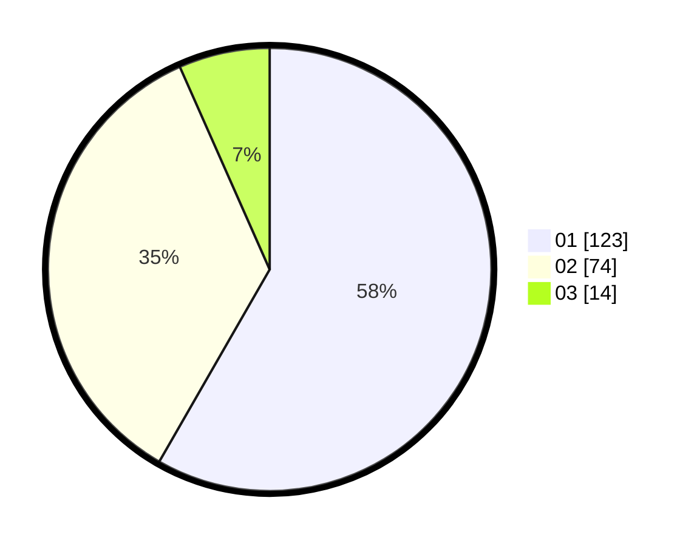

# Hasil

Hasil perolehan suara paslon dapat dilihat pada file paslon-01.txt, paslon-02.txt, dan paslon-03.txt.

Jika tidak ada, artinya data tersebut belum ada pada SIREKAP.

## Perolehan Suara

 * Paslon 01: **123**.
 * Paslon 02: **74**.
 * Paslon 03: **14**.

## Foto C Plano

https://sirekap-obj-formc.kpu.go.id/dde6/pemilu/ppwp/31/73/07/10/06/3173071006058-20240214-212424--e816e798-6faf-45b5-a2da-70702aaddbe7.jpg

https://sirekap-obj-formc.kpu.go.id/dde6/pemilu/ppwp/31/73/07/10/06/3173071006058-20240214-201241--f10087d1-797b-429a-bf35-088195429798.jpg

https://sirekap-obj-formc.kpu.go.id/dde6/pemilu/ppwp/31/73/07/10/06/3173071006058-20240214-201327--a959d2db-81d4-44ab-b81f-de8e7fb5f119.jpg
