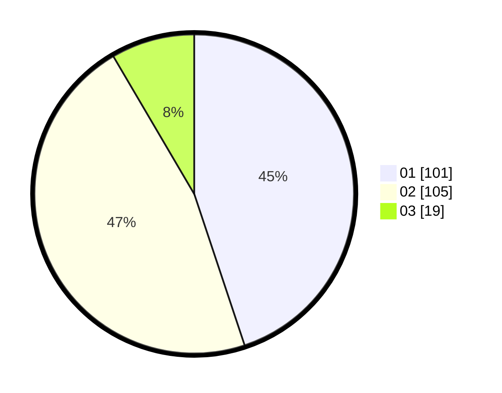

# Hasil

Hasil perolehan suara paslon dapat dilihat pada file paslon-01.txt, paslon-02.txt, dan paslon-03.txt.

Jika tidak ada, artinya data tersebut belum ada pada SIREKAP.

## Perolehan Suara

 * Paslon 01: **101**.
 * Paslon 02: **105**.
 * Paslon 03: **19**.

## Foto C Plano

https://sirekap-obj-formc.kpu.go.id/b3b4/pemilu/ppwp/31/73/07/10/06/3173071006060-20240214-194437--5f78c8c9-6726-4f43-949e-6855469860da.jpg

https://sirekap-obj-formc.kpu.go.id/b3b4/pemilu/ppwp/31/73/07/10/06/3173071006060-20240214-194624--fc86a17d-9c9d-4b16-936f-b87cd4a7fa88.jpg

https://sirekap-obj-formc.kpu.go.id/b3b4/pemilu/ppwp/31/73/07/10/06/3173071006060-20240214-194749--53e2a61c-198f-4f85-958b-4566363cbe14.jpg

## DATA PEMILIH TETAP

Jumlah pemilih dalam DPT: **272**.
 * L: **139**.
 * P: **133**.

## DATA PENGGUNA HAK PILIH

Jumlah pengguna hak pilih dalam DPT: **225**.
 * L: **114**.
 * P: **111**.

Jumlah pengguna hak pilih dalam DPTb: **0**.
 * L: **0**.
 * P: **0**.

Jumlah pengguna hak pilih dalam DPK: **2**.
 * L: **1**.
 * P: **1**.

Jumlah pengguna hak pilih: **227**.
 * L: **115**.
 * P: **112**.

## JUMLAH SUARA SAH DAN TIDAK SAH

JUMLAH SELURUH SUARA SAH: **225**.

JUMLAH SUARA TIDAK SAH: **2**.

JUMLAH SELURUH SUARA SAH DAN SUARA TIDAK SAH: **227**.
