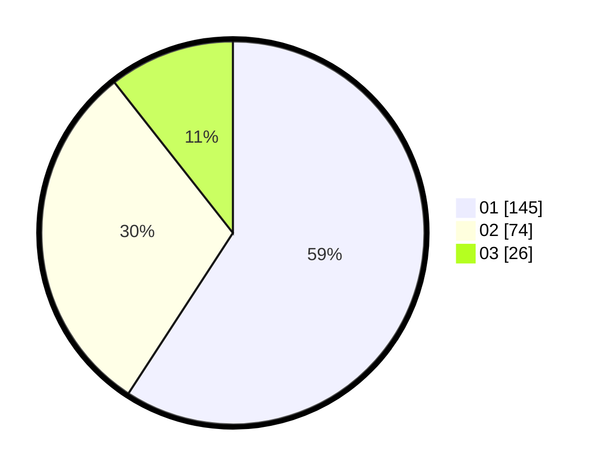

# Hasil

Hasil perolehan suara paslon dapat dilihat pada file paslon-01.txt, paslon-02.txt, dan paslon-03.txt.

Jika tidak ada, artinya data tersebut belum ada pada SIREKAP.

## Perolehan Suara

 * Paslon 01: **145**.
 * Paslon 02: **74**.
 * Paslon 03: **26**.

## Foto C Plano

https://sirekap-obj-formc.kpu.go.id/f35a/pemilu/ppwp/31/73/07/10/06/3173071006068-20240214-212132--72495adb-a676-4b2e-b833-5639d0eabb95.jpg

https://sirekap-obj-formc.kpu.go.id/f35a/pemilu/ppwp/31/73/07/10/06/3173071006068-20240214-212326--a4942c65-f887-41f0-9b8e-93492313e801.jpg

https://sirekap-obj-formc.kpu.go.id/f35a/pemilu/ppwp/31/73/07/10/06/3173071006068-20240214-212540--565f9fb5-afab-4c20-972c-a2e5c256fccc.jpg
