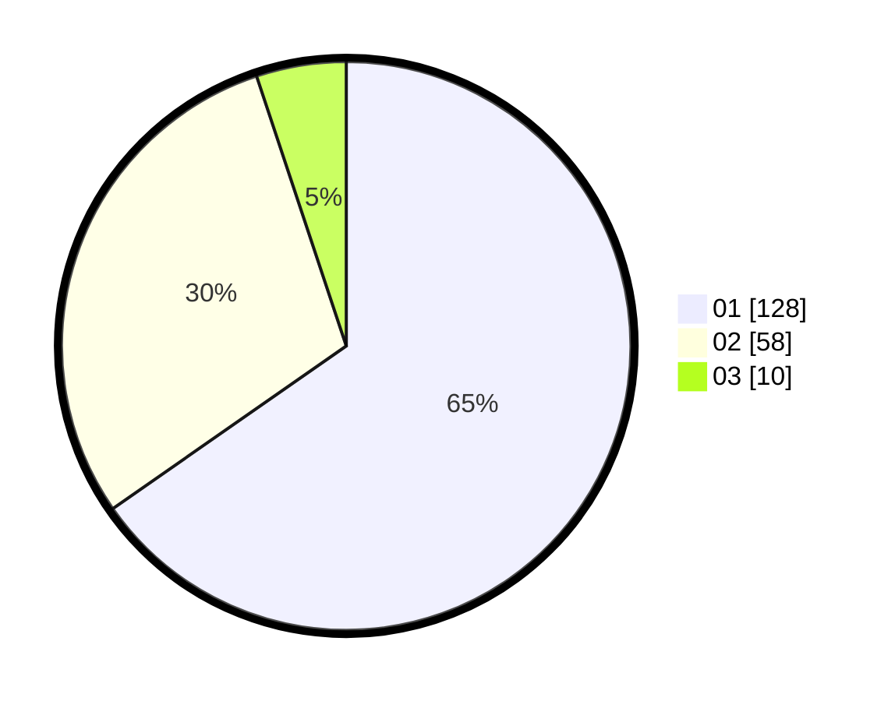

# Hasil

Hasil perolehan suara paslon dapat dilihat pada file paslon-01.txt, paslon-02.txt, dan paslon-03.txt.

Jika tidak ada, artinya data tersebut belum ada pada SIREKAP.

## Perolehan Suara

 * Paslon 01: **128**.
 * Paslon 02: **58**.
 * Paslon 03: **10**.

## Foto C Plano

https://sirekap-obj-formc.kpu.go.id/8fd8/pemilu/ppwp/31/73/07/10/06/3173071006069-20240214-194438--003d6163-f9d5-4a45-b43f-68404f14baa3.jpg

https://sirekap-obj-formc.kpu.go.id/8fd8/pemilu/ppwp/31/73/07/10/06/3173071006069-20240214-193553--0377dacf-72a7-4245-8b92-ce52cc537a3d.jpg

https://sirekap-obj-formc.kpu.go.id/8fd8/pemilu/ppwp/31/73/07/10/06/3173071006069-20240214-193646--5b774fc9-5e9a-4436-a4d0-576d0e9df9cc.jpg
