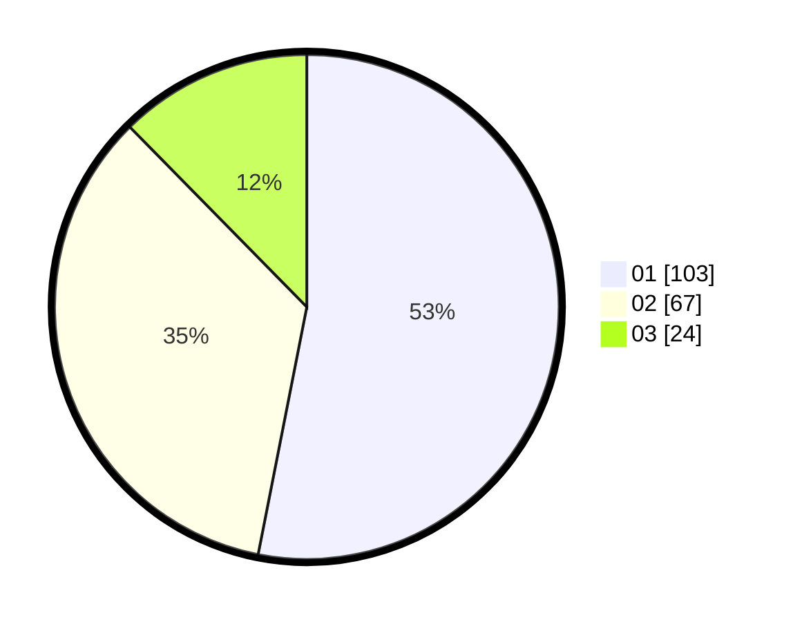

# Hasil

Hasil perolehan suara paslon dapat dilihat pada file paslon-01.txt, paslon-02.txt, dan paslon-03.txt.

Jika tidak ada, artinya data tersebut belum ada pada SIREKAP.

## Perolehan Suara

 * Paslon 01: **103**.
 * Paslon 02: **67**.
 * Paslon 03: **24**.

## Foto C Plano

https://sirekap-obj-formc.kpu.go.id/ec95/pemilu/ppwp/31/73/07/10/06/3173071006070-20240215-004158--62f8d7f8-5766-4aae-95fc-9098a05603d7.jpg

https://sirekap-obj-formc.kpu.go.id/ec95/pemilu/ppwp/31/73/07/10/06/3173071006070-20240215-004132--fee6c53e-a43c-4080-ab1e-ada47af348f6.jpg

https://sirekap-obj-formc.kpu.go.id/ec95/pemilu/ppwp/31/73/07/10/06/3173071006070-20240215-003914--c1142ad1-6961-4b56-bcd5-5d83abbacb12.jpg
