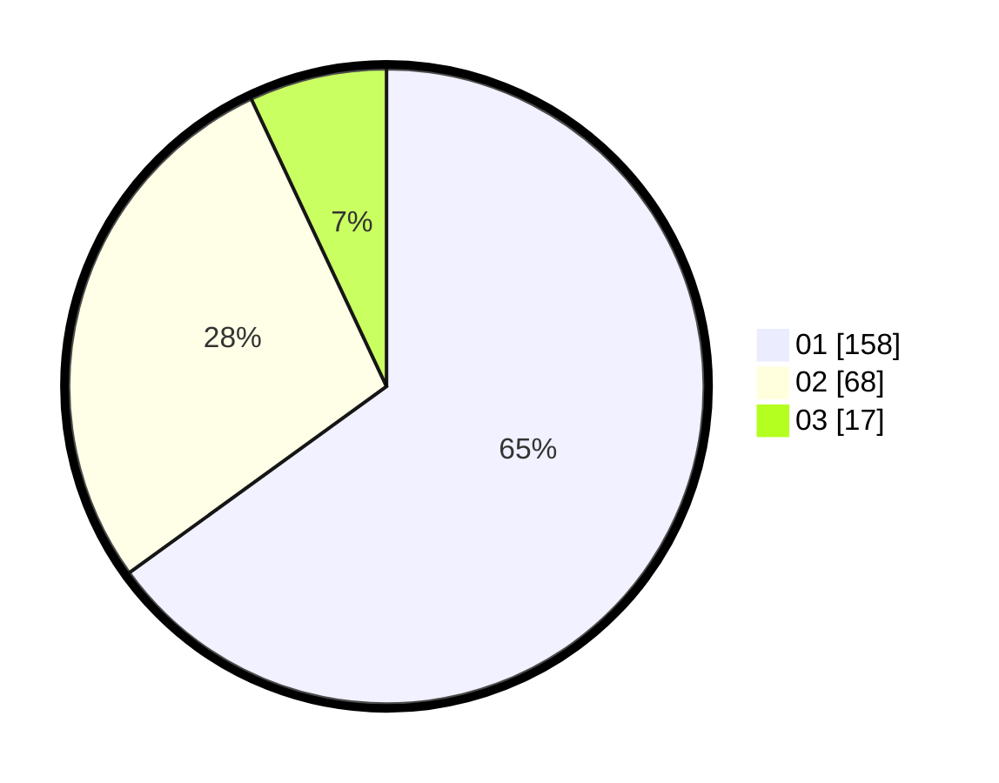

# Hasil

Hasil perolehan suara paslon dapat dilihat pada file paslon-01.txt, paslon-02.txt, dan paslon-03.txt.

Jika tidak ada, artinya data tersebut belum ada pada SIREKAP.

## Perolehan Suara

 * Paslon 01: **158**.
 * Paslon 02: **68**.
 * Paslon 03: **17**.

## Foto C Plano

https://sirekap-obj-formc.kpu.go.id/5100/pemilu/ppwp/31/73/07/10/06/3173071006075-20240216-111420--6ca2739b-3272-4616-a624-2605812f9366.jpg

https://sirekap-obj-formc.kpu.go.id/5100/pemilu/ppwp/31/73/07/10/06/3173071006075-20240216-111435--3af9fbca-5171-4e9d-9976-c24427534671.jpg

https://sirekap-obj-formc.kpu.go.id/5100/pemilu/ppwp/31/73/07/10/06/3173071006075-20240216-111426--455b6657-52d0-42e9-b4d4-7f835f685b2a.jpg

## DATA PEMILIH TETAP

Jumlah pemilih dalam DPT: **279**.
 * L: **130**.
 * P: **149**.

## DATA PENGGUNA HAK PILIH

Jumlah pengguna hak pilih dalam DPT: **237**.
 * L: **104**.
 * P: **133**.

Jumlah pengguna hak pilih dalam DPTb: **5**.
 * L: **0**.
 * P: **5**.

Jumlah pengguna hak pilih dalam DPK: **2**.
 * L: **1**.
 * P: **1**.

Jumlah pengguna hak pilih: **244**.
 * L: **105**.
 * P: **139**.

## JUMLAH SUARA SAH DAN TIDAK SAH

JUMLAH SELURUH SUARA SAH: **243**.

JUMLAH SUARA TIDAK SAH: **1**.

JUMLAH SELURUH SUARA SAH DAN SUARA TIDAK SAH: **244**.
