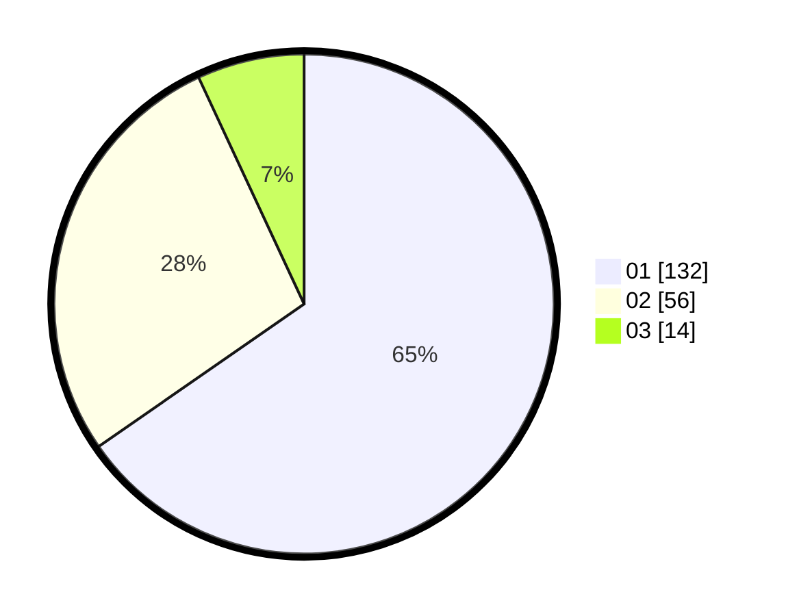

# Hasil

Hasil perolehan suara paslon dapat dilihat pada file paslon-01.txt, paslon-02.txt, dan paslon-03.txt.

Jika tidak ada, artinya data tersebut belum ada pada SIREKAP.

## Perolehan Suara

 * Paslon 01: **132**.
 * Paslon 02: **56**.
 * Paslon 03: **14**.

## Foto C Plano

https://sirekap-obj-formc.kpu.go.id/c424/pemilu/ppwp/31/73/07/10/06/3173071006078-20240214-194327--46175560-e55b-4cb2-a59b-8adf3e0488cd.jpg

https://sirekap-obj-formc.kpu.go.id/c424/pemilu/ppwp/31/73/07/10/06/3173071006078-20240214-194433--ddf2a9c9-f366-4f59-9484-d584a87898cd.jpg

https://sirekap-obj-formc.kpu.go.id/c424/pemilu/ppwp/31/73/07/10/06/3173071006078-20240214-194514--2a558f8c-fc13-47a6-a9b3-178997f01f6d.jpg

## DATA PEMILIH TETAP

Jumlah pemilih dalam DPT: **215**.
 * L: **107**.
 * P: **108**.

## DATA PENGGUNA HAK PILIH

Jumlah pengguna hak pilih dalam DPT: **189**.
 * L: **92**.
 * P: **97**.

Jumlah pengguna hak pilih dalam DPTb: **12**.
 * L: **5**.
 * P: **7**.

Jumlah pengguna hak pilih dalam DPK: **2**.
 * L: **0**.
 * P: **2**.

Jumlah pengguna hak pilih: **203**.
 * L: **97**.
 * P: **106**.

## JUMLAH SUARA SAH DAN TIDAK SAH

JUMLAH SELURUH SUARA SAH: **202**.

JUMLAH SUARA TIDAK SAH: **1**.

JUMLAH SELURUH SUARA SAH DAN SUARA TIDAK SAH: **203**.
