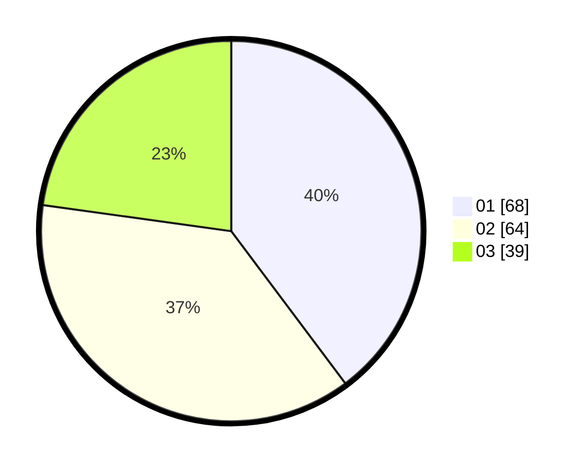

# Hasil

Hasil perolehan suara paslon dapat dilihat pada file paslon-01.txt, paslon-02.txt, dan paslon-03.txt.

Jika tidak ada, artinya data tersebut belum ada pada SIREKAP.

## Perolehan Suara

 * Paslon 01: **68**.
 * Paslon 02: **64**.
 * Paslon 03: **39**.

## Foto C Plano

https://sirekap-obj-formc.kpu.go.id/5f1c/pemilu/ppwp/31/73/08/10/01/3173081001006-20240214-200607--3558d2ef-1564-4bf4-bf05-32432b3f8fd1.jpg

https://sirekap-obj-formc.kpu.go.id/5f1c/pemilu/ppwp/31/73/08/10/01/3173081001006-20240214-225356--cba6953c-7cc4-4885-8da5-a4f07b4d38cc.jpg

https://sirekap-obj-formc.kpu.go.id/5f1c/pemilu/ppwp/31/73/08/10/01/3173081001006-20240214-200900--677174d7-13c6-48ea-bb06-b58902fa5d75.jpg

## DATA PEMILIH TETAP

Jumlah pemilih dalam DPT: **229**.
 * L: **109**.
 * P: **120**.

## DATA PENGGUNA HAK PILIH

Jumlah pengguna hak pilih dalam DPT: **158**.
 * L: **73**.
 * P: **85**.

Jumlah pengguna hak pilih dalam DPTb: **11**.
 * L: **3**.
 * P: **8**.

Jumlah pengguna hak pilih dalam DPK: **5**.
 * L: **3**.
 * P: **2**.

Jumlah pengguna hak pilih: **174**.
 * L: **79**.
 * P: **95**.

## JUMLAH SUARA SAH DAN TIDAK SAH

JUMLAH SELURUH SUARA SAH: **171**.

JUMLAH SUARA TIDAK SAH: **3**.

JUMLAH SELURUH SUARA SAH DAN SUARA TIDAK SAH: **174**.
