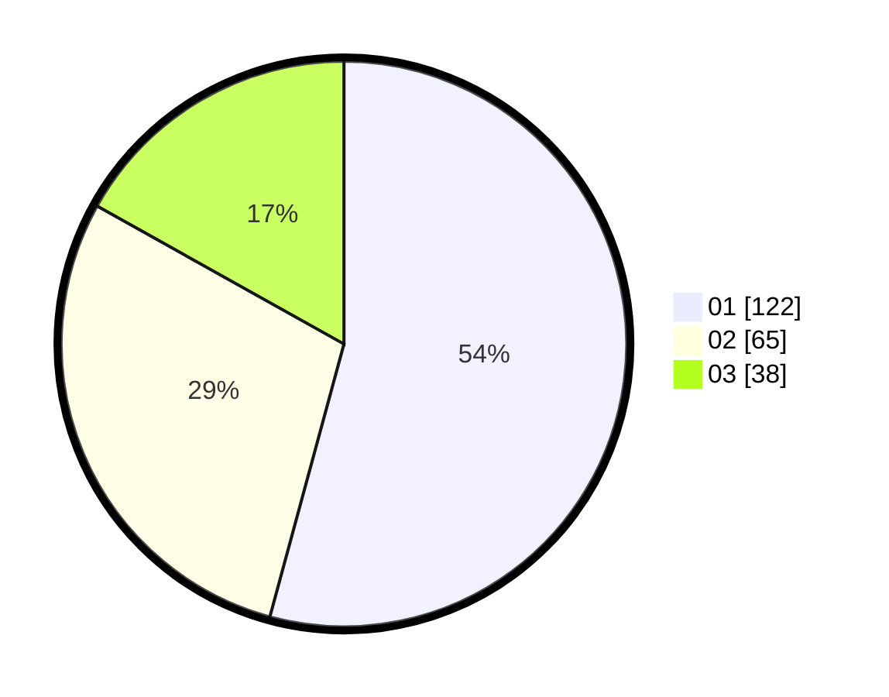

# Hasil

Hasil perolehan suara paslon dapat dilihat pada file paslon-01.txt, paslon-02.txt, dan paslon-03.txt.

Jika tidak ada, artinya data tersebut belum ada pada SIREKAP.

## Perolehan Suara

 * Paslon 01: **122**.
 * Paslon 02: **65**.
 * Paslon 03: **38**.

## Foto C Plano

https://sirekap-obj-formc.kpu.go.id/6f36/pemilu/ppwp/31/73/08/10/01/3173081001007-20240216-220849--7e220611-b51c-42f5-a451-b1b3f3dadcfb.jpg

https://sirekap-obj-formc.kpu.go.id/6f36/pemilu/ppwp/31/73/08/10/01/3173081001007-20240216-220850--d60d00a0-5fea-404e-b632-379655c825b3.jpg

https://sirekap-obj-formc.kpu.go.id/6f36/pemilu/ppwp/31/73/08/10/01/3173081001007-20240216-220849--7a0ba5f6-7b1f-45b8-877d-9be2edeb792f.jpg

## DATA PEMILIH TETAP

Jumlah pemilih dalam DPT: **277**.
 * L: **133**.
 * P: **144**.

## DATA PENGGUNA HAK PILIH

Jumlah pengguna hak pilih dalam DPT: **218**.
 * L: **107**.
 * P: **111**.

Jumlah pengguna hak pilih dalam DPTb: **10**.
 * L: **7**.
 * P: **3**.

Jumlah pengguna hak pilih dalam DPK: **1**.
 * L: **0**.
 * P: **1**.

Jumlah pengguna hak pilih: **229**.
 * L: **114**.
 * P: **115**.

## JUMLAH SUARA SAH DAN TIDAK SAH

JUMLAH SELURUH SUARA SAH: **225**.

JUMLAH SUARA TIDAK SAH: **4**.

JUMLAH SELURUH SUARA SAH DAN SUARA TIDAK SAH: **229**.
