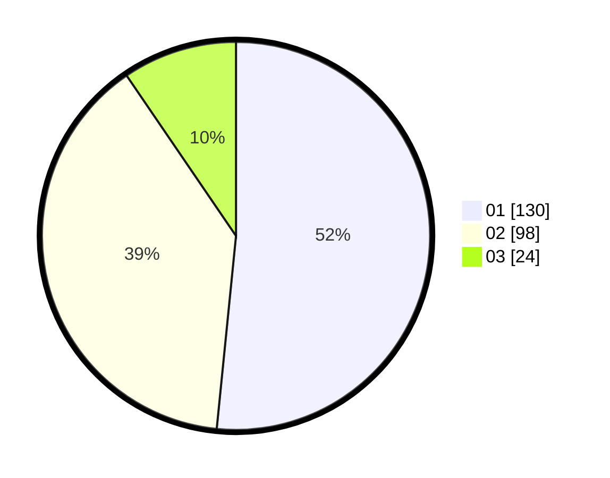

# Hasil

Hasil perolehan suara paslon dapat dilihat pada file paslon-01.txt, paslon-02.txt, dan paslon-03.txt.

Jika tidak ada, artinya data tersebut belum ada pada SIREKAP.

## Perolehan Suara

 * Paslon 01: **130**.
 * Paslon 02: **98**.
 * Paslon 03: **24**.

## Foto C Plano

https://sirekap-obj-formc.kpu.go.id/e15c/pemilu/ppwp/31/73/08/10/01/3173081001008-20240216-065109--0ba57d8c-30a9-4526-80c7-a5329609644c.jpg

https://sirekap-obj-formc.kpu.go.id/e15c/pemilu/ppwp/31/73/08/10/01/3173081001008-20240216-065110--79d3e77a-f017-443c-ad4d-210b96bb13db.jpg

https://sirekap-obj-formc.kpu.go.id/e15c/pemilu/ppwp/31/73/08/10/01/3173081001008-20240216-065110--5f549a09-0ecf-49ec-96ef-7be700e53497.jpg

## DATA PEMILIH TETAP

Jumlah pemilih dalam DPT: **280**.
 * L: **151**.
 * P: **129**.

## DATA PENGGUNA HAK PILIH

Jumlah pengguna hak pilih dalam DPT: **240**.
 * L: **131**.
 * P: **109**.

Jumlah pengguna hak pilih dalam DPTb: **11**.
 * L: **4**.
 * P: **7**.

Jumlah pengguna hak pilih dalam DPK: **3**.
 * L: **2**.
 * P: **1**.

Jumlah pengguna hak pilih: **254**.
 * L: **137**.
 * P: **117**.

## JUMLAH SUARA SAH DAN TIDAK SAH

JUMLAH SELURUH SUARA SAH: **252**.

JUMLAH SUARA TIDAK SAH: **2**.

JUMLAH SELURUH SUARA SAH DAN SUARA TIDAK SAH: **254**.
