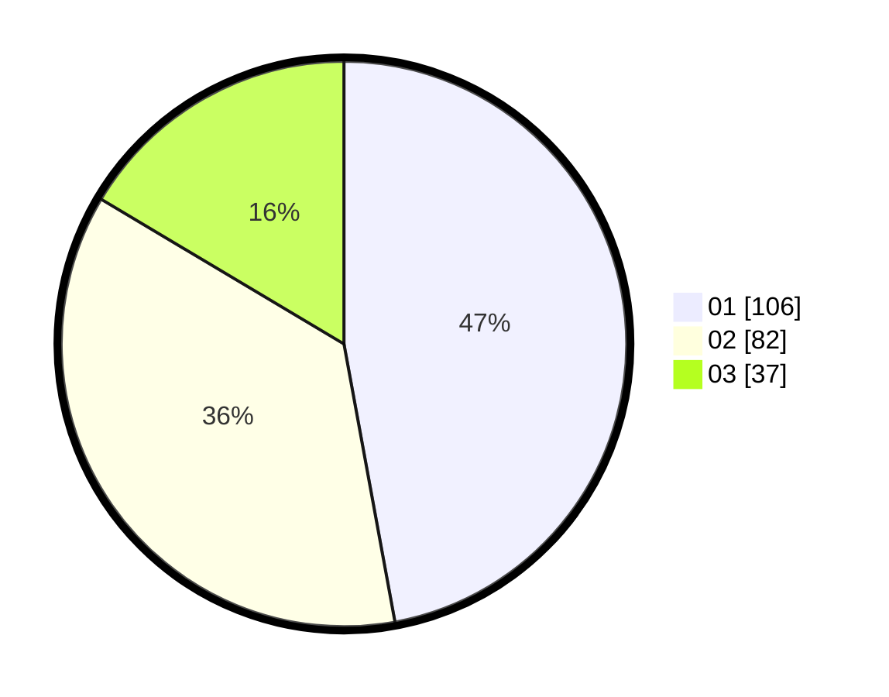

# Hasil

Hasil perolehan suara paslon dapat dilihat pada file paslon-01.txt, paslon-02.txt, dan paslon-03.txt.

Jika tidak ada, artinya data tersebut belum ada pada SIREKAP.

## Perolehan Suara

 * Paslon 01: **106**.
 * Paslon 02: **82**.
 * Paslon 03: **37**.

## Foto C Plano

https://sirekap-obj-formc.kpu.go.id/230d/pemilu/ppwp/31/73/08/10/01/3173081001013-20240214-192240--71f726a5-4ecf-4710-8437-33889973cf94.jpg

https://sirekap-obj-formc.kpu.go.id/230d/pemilu/ppwp/31/73/08/10/01/3173081001013-20240214-192319--a15a47cd-4ffa-4494-8eda-42076b852f93.jpg

https://sirekap-obj-formc.kpu.go.id/230d/pemilu/ppwp/31/73/08/10/01/3173081001013-20240214-192335--73912548-79f5-4522-85dd-ba8405f05c04.jpg
