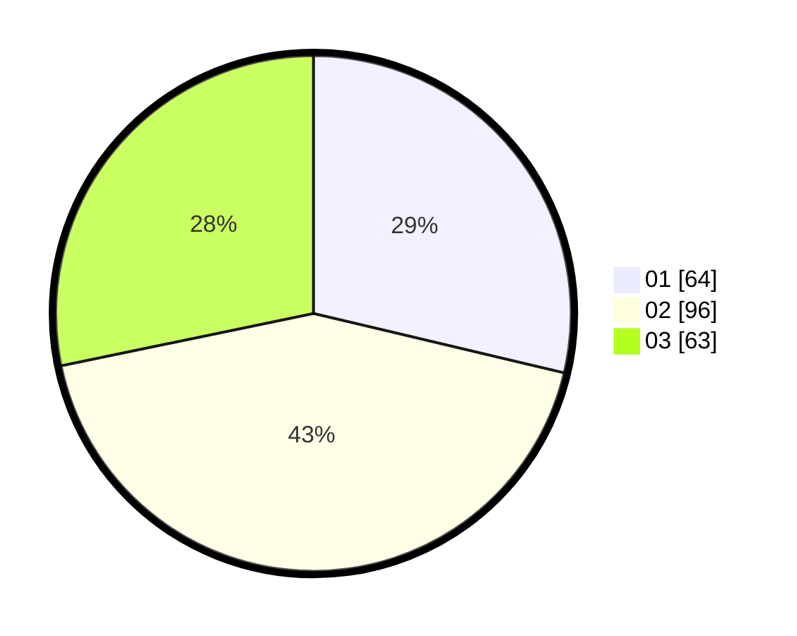

# Hasil

Hasil perolehan suara paslon dapat dilihat pada file paslon-01.txt, paslon-02.txt, dan paslon-03.txt.

Jika tidak ada, artinya data tersebut belum ada pada SIREKAP.

## Perolehan Suara

 * Paslon 01: **64**.
 * Paslon 02: **96**.
 * Paslon 03: **63**.

## Foto C Plano

https://sirekap-obj-formc.kpu.go.id/3898/pemilu/ppwp/31/73/08/10/01/3173081001014-20240214-234835--26b99b79-fc3c-4943-9a93-c649e64e9fa0.jpg

https://sirekap-obj-formc.kpu.go.id/3898/pemilu/ppwp/31/73/08/10/01/3173081001014-20240215-000420--2063c7a7-53f4-4287-b564-40091c387b9c.jpg

https://sirekap-obj-formc.kpu.go.id/3898/pemilu/ppwp/31/73/08/10/01/3173081001014-20240214-235420--6f61c5a1-5ec8-4168-a73e-59c2a56caa18.jpg
