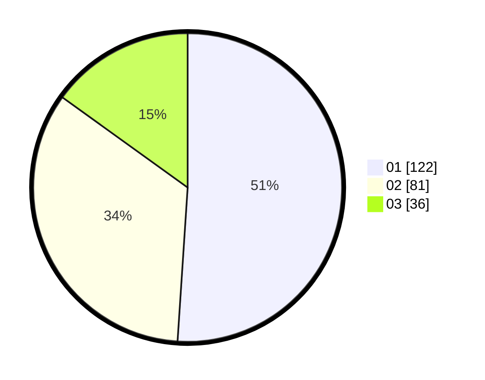

# Hasil

Hasil perolehan suara paslon dapat dilihat pada file paslon-01.txt, paslon-02.txt, dan paslon-03.txt.

Jika tidak ada, artinya data tersebut belum ada pada SIREKAP.

## Perolehan Suara

 * Paslon 01: **122**.
 * Paslon 02: **81**.
 * Paslon 03: **36**.

## Foto C Plano

https://sirekap-obj-formc.kpu.go.id/7a1c/pemilu/ppwp/31/73/08/10/01/3173081001016-20240215-002629--4a68535e-a175-493c-a5b8-39770c7cdeb5.jpg

https://sirekap-obj-formc.kpu.go.id/7a1c/pemilu/ppwp/31/73/08/10/01/3173081001016-20240215-002807--10bc1853-d9c6-4c66-bdfa-461a5fb57c4a.jpg

https://sirekap-obj-formc.kpu.go.id/7a1c/pemilu/ppwp/31/73/08/10/01/3173081001016-20240214-235010--7c9950d3-6798-4b43-b515-c983e6fe5ebe.jpg

## DATA PEMILIH TETAP

Jumlah pemilih dalam DPT: **280**.
 * L: **140**.
 * P: **140**.

## DATA PENGGUNA HAK PILIH

Jumlah pengguna hak pilih dalam DPT: **240**.
 * L: **116**.
 * P: **124**.

Jumlah pengguna hak pilih dalam DPTb: **0**.
 * L: **0**.
 * P: **0**.

Jumlah pengguna hak pilih dalam DPK: **4**.
 * L: **2**.
 * P: **2**.

Jumlah pengguna hak pilih: **244**.
 * L: **118**.
 * P: **126**.

## JUMLAH SUARA SAH DAN TIDAK SAH

JUMLAH SELURUH SUARA SAH: **239**.

JUMLAH SUARA TIDAK SAH: **5**.

JUMLAH SELURUH SUARA SAH DAN SUARA TIDAK SAH: **244**.
