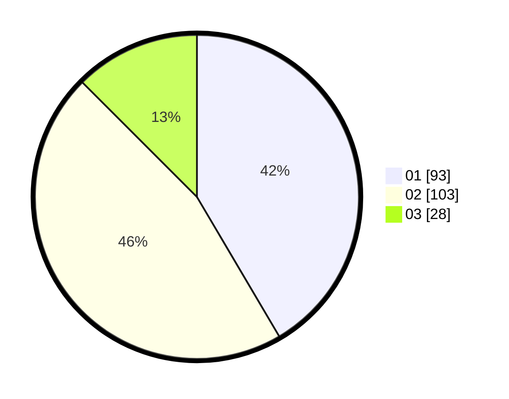

# Hasil

Hasil perolehan suara paslon dapat dilihat pada file paslon-01.txt, paslon-02.txt, dan paslon-03.txt.

Jika tidak ada, artinya data tersebut belum ada pada SIREKAP.

## Perolehan Suara

 * Paslon 01: **93**.
 * Paslon 02: **103**.
 * Paslon 03: **28**.

## Foto C Plano

https://sirekap-obj-formc.kpu.go.id/266d/pemilu/ppwp/31/73/08/10/01/3173081001019-20240216-014542--4b858c00-387a-4d77-a9ac-354390749bb5.jpg

https://sirekap-obj-formc.kpu.go.id/266d/pemilu/ppwp/31/73/08/10/01/3173081001019-20240216-014551--a83d4d58-d5a7-468f-843e-2d0cd739e680.jpg

https://sirekap-obj-formc.kpu.go.id/266d/pemilu/ppwp/31/73/08/10/01/3173081001019-20240216-013113--c20fc079-abe0-48d7-b669-f03cc981c7ff.jpg

## DATA PEMILIH TETAP

Jumlah pemilih dalam DPT: **277**.
 * L: **138**.
 * P: **139**.

## DATA PENGGUNA HAK PILIH

Jumlah pengguna hak pilih dalam DPT: **228**.
 * L: **110**.
 * P: **118**.

Jumlah pengguna hak pilih dalam DPTb: **0**.
 * L: **0**.
 * P: **0**.

Jumlah pengguna hak pilih dalam DPK: **0**.
 * L: **0**.
 * P: **0**.

Jumlah pengguna hak pilih: **228**.
 * L: **110**.
 * P: **118**.

## JUMLAH SUARA SAH DAN TIDAK SAH

JUMLAH SELURUH SUARA SAH: **224**.

JUMLAH SUARA TIDAK SAH: **4**.

JUMLAH SELURUH SUARA SAH DAN SUARA TIDAK SAH: **228**.
