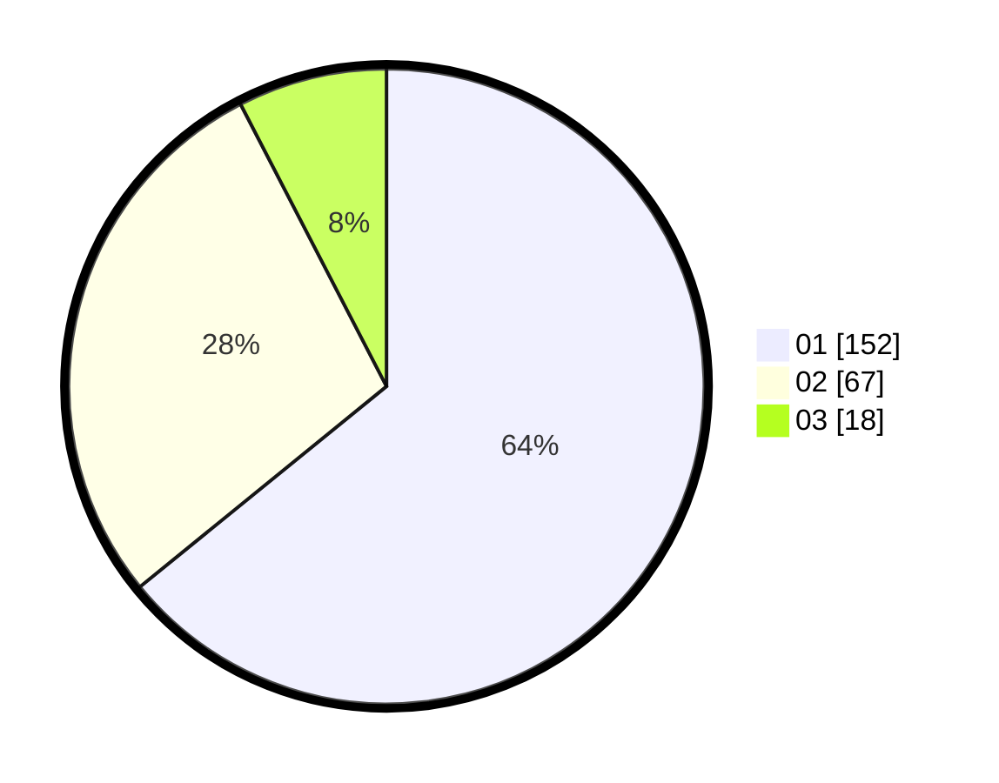

# Hasil

Hasil perolehan suara paslon dapat dilihat pada file paslon-01.txt, paslon-02.txt, dan paslon-03.txt.

Jika tidak ada, artinya data tersebut belum ada pada SIREKAP.

## Perolehan Suara

 * Paslon 01: **152**.
 * Paslon 02: **67**.
 * Paslon 03: **18**.

## Foto C Plano

https://sirekap-obj-formc.kpu.go.id/1253/pemilu/ppwp/31/73/08/10/01/3173081001024-20240214-224541--3a44ae21-ccd6-4ed2-9e3d-78e57aa58248.jpg

https://sirekap-obj-formc.kpu.go.id/1253/pemilu/ppwp/31/73/08/10/01/3173081001024-20240214-224703--af894326-2985-4403-bc01-1ef4674d269c.jpg

https://sirekap-obj-formc.kpu.go.id/1253/pemilu/ppwp/31/73/08/10/01/3173081001024-20240214-224815--d89d94c5-31bb-479e-8570-8ea3fbf696e8.jpg
