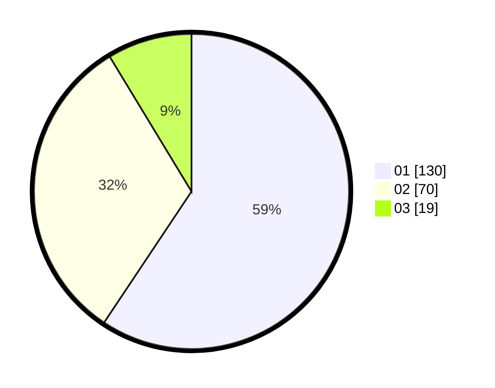

# Hasil

Hasil perolehan suara paslon dapat dilihat pada file paslon-01.txt, paslon-02.txt, dan paslon-03.txt.

Jika tidak ada, artinya data tersebut belum ada pada SIREKAP.

## Perolehan Suara

 * Paslon 01: **130**.
 * Paslon 02: **70**.
 * Paslon 03: **19**.

## Foto C Plano

https://sirekap-obj-formc.kpu.go.id/5106/pemilu/ppwp/31/73/08/10/01/3173081001037-20240215-015257--a0474895-7b82-4efe-b289-33adbf4a3cdd.jpg

https://sirekap-obj-formc.kpu.go.id/5106/pemilu/ppwp/31/73/08/10/01/3173081001037-20240215-020815--fce702bb-96c5-44d0-b254-299317ee3704.jpg

https://sirekap-obj-formc.kpu.go.id/5106/pemilu/ppwp/31/73/08/10/01/3173081001037-20240215-015620--21508cc2-e8ef-49c3-a095-d3ad799e955d.jpg
