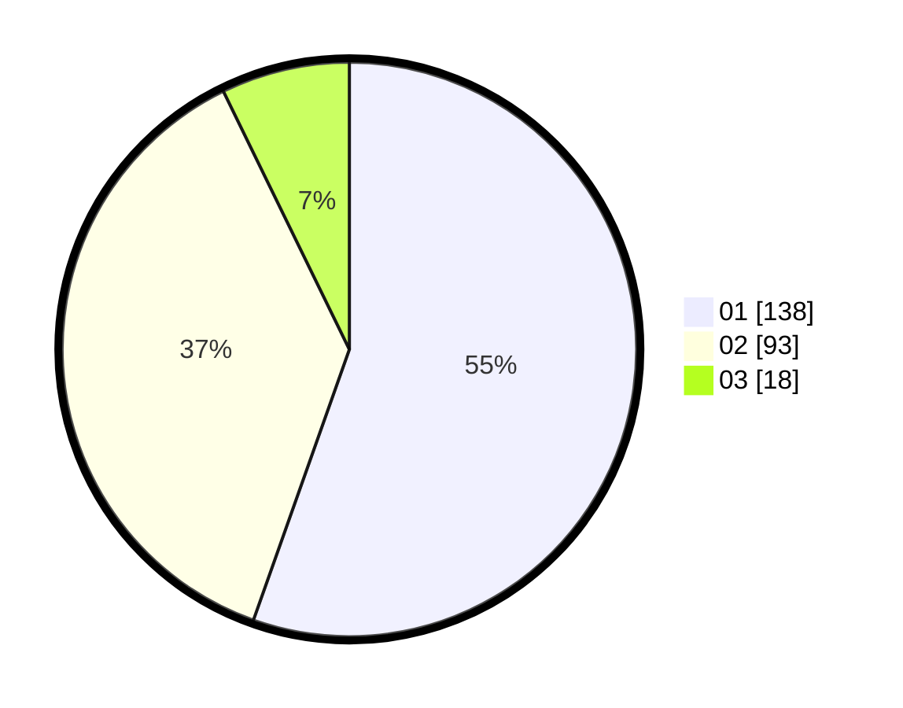

# Hasil

Hasil perolehan suara paslon dapat dilihat pada file paslon-01.txt, paslon-02.txt, dan paslon-03.txt.

Jika tidak ada, artinya data tersebut belum ada pada SIREKAP.

## Perolehan Suara

 * Paslon 01: **138**.
 * Paslon 02: **93**.
 * Paslon 03: **18**.

## Foto C Plano

https://sirekap-obj-formc.kpu.go.id/d85e/pemilu/ppwp/31/73/08/10/01/3173081001039-20240214-225611--9b8f2de9-d43d-4054-b986-ea79081383d1.jpg

https://sirekap-obj-formc.kpu.go.id/d85e/pemilu/ppwp/31/73/08/10/01/3173081001039-20240214-224717--d9047e59-1122-4a33-80a3-39047cb33b45.jpg

https://sirekap-obj-formc.kpu.go.id/d85e/pemilu/ppwp/31/73/08/10/01/3173081001039-20240214-224816--885f5070-6659-4efa-aaa1-2479dd605c83.jpg
