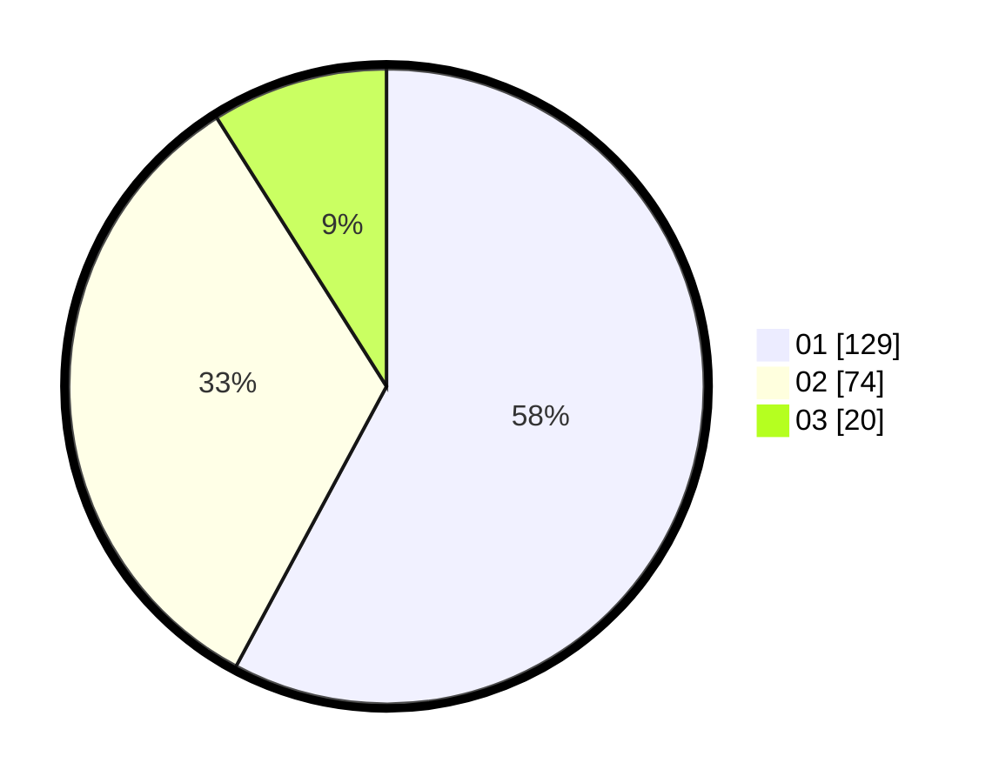

# Hasil

Hasil perolehan suara paslon dapat dilihat pada file paslon-01.txt, paslon-02.txt, dan paslon-03.txt.

Jika tidak ada, artinya data tersebut belum ada pada SIREKAP.

## Perolehan Suara

 * Paslon 01: **129**.
 * Paslon 02: **74**.
 * Paslon 03: **20**.

## Foto C Plano

https://sirekap-obj-formc.kpu.go.id/1ad5/pemilu/ppwp/31/73/08/10/01/3173081001040-20240215-001220--4b196b78-c482-43e8-9fb6-1cf85c9d6c5a.jpg

https://sirekap-obj-formc.kpu.go.id/1ad5/pemilu/ppwp/31/73/08/10/01/3173081001040-20240215-021022--d2af989e-1ec6-49d1-8ce2-092ffc71e18d.jpg

https://sirekap-obj-formc.kpu.go.id/1ad5/pemilu/ppwp/31/73/08/10/01/3173081001040-20240215-001334--4bd11896-0e8a-4e73-a033-0d83226bdd41.jpg
