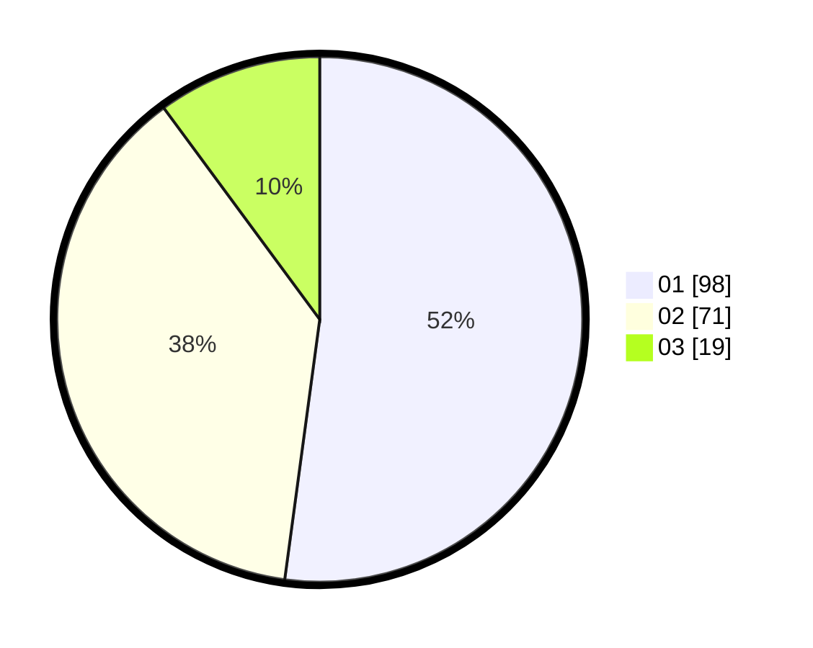

# Hasil

Hasil perolehan suara paslon dapat dilihat pada file paslon-01.txt, paslon-02.txt, dan paslon-03.txt.

Jika tidak ada, artinya data tersebut belum ada pada SIREKAP.

## Perolehan Suara

 * Paslon 01: **98**.
 * Paslon 02: **71**.
 * Paslon 03: **19**.

## Foto C Plano

https://sirekap-obj-formc.kpu.go.id/d9fc/pemilu/ppwp/31/73/08/10/01/3173081001048-20240215-014449--7fade296-351a-4560-ae61-e2a0dc78eb17.jpg

https://sirekap-obj-formc.kpu.go.id/d9fc/pemilu/ppwp/31/73/08/10/01/3173081001048-20240215-014557--b5d736e6-8227-4ce3-b0bf-2bdc02252780.jpg

https://sirekap-obj-formc.kpu.go.id/d9fc/pemilu/ppwp/31/73/08/10/01/3173081001048-20240215-014658--1c81cb46-a8d1-4cb2-81e7-2a8e8399a830.jpg
