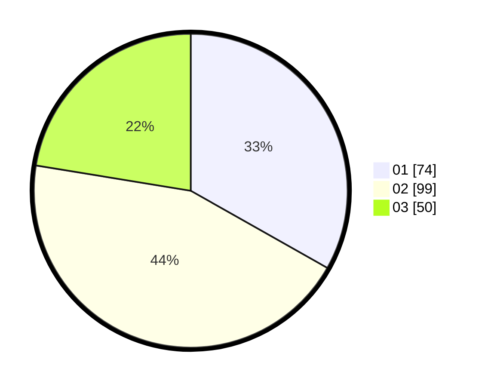

# Hasil

Hasil perolehan suara paslon dapat dilihat pada file paslon-01.txt, paslon-02.txt, dan paslon-03.txt.

Jika tidak ada, artinya data tersebut belum ada pada SIREKAP.

## Perolehan Suara

 * Paslon 01: **74**.
 * Paslon 02: **99**.
 * Paslon 03: **50**.

## Foto C Plano

https://sirekap-obj-formc.kpu.go.id/10ee/pemilu/ppwp/31/73/08/10/01/3173081001051-20240214-235020--eb724eb1-64d0-4b8e-a29c-cc279d7b4e24.jpg

https://sirekap-obj-formc.kpu.go.id/10ee/pemilu/ppwp/31/73/08/10/01/3173081001051-20240214-234811--366a96e7-3404-443d-be39-b883a9874bd5.jpg

https://sirekap-obj-formc.kpu.go.id/10ee/pemilu/ppwp/31/73/08/10/01/3173081001051-20240214-235212--9bafee1f-25a6-4de3-9de6-97edf82a9b86.jpg
