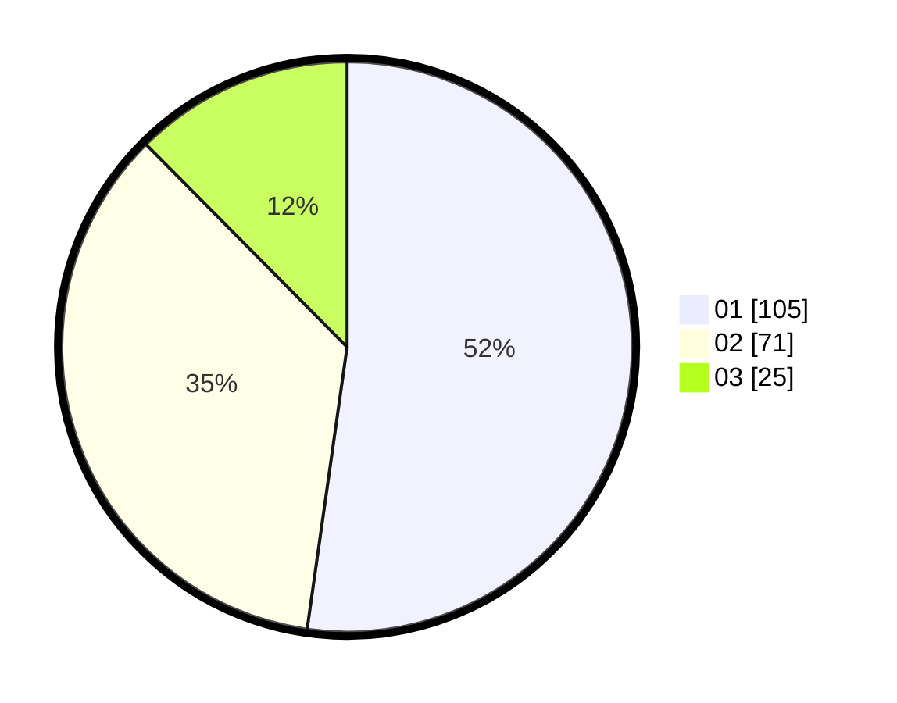

# Hasil

Hasil perolehan suara paslon dapat dilihat pada file paslon-01.txt, paslon-02.txt, dan paslon-03.txt.

Jika tidak ada, artinya data tersebut belum ada pada SIREKAP.

## Perolehan Suara

 * Paslon 01: **105**.
 * Paslon 02: **71**.
 * Paslon 03: **25**.

## Foto C Plano

https://sirekap-obj-formc.kpu.go.id/651d/pemilu/ppwp/31/73/08/10/01/3173081001055-20240214-223603--6bc0afe7-ef74-41e3-bf8c-94192014495c.jpg

https://sirekap-obj-formc.kpu.go.id/651d/pemilu/ppwp/31/73/08/10/01/3173081001055-20240214-223755--a5aaaed1-b75c-4641-8b55-6ef1d718112e.jpg

https://sirekap-obj-formc.kpu.go.id/651d/pemilu/ppwp/31/73/08/10/01/3173081001055-20240214-223837--e8f42c21-a2e7-455c-a853-79cc5e2cd0d7.jpg
