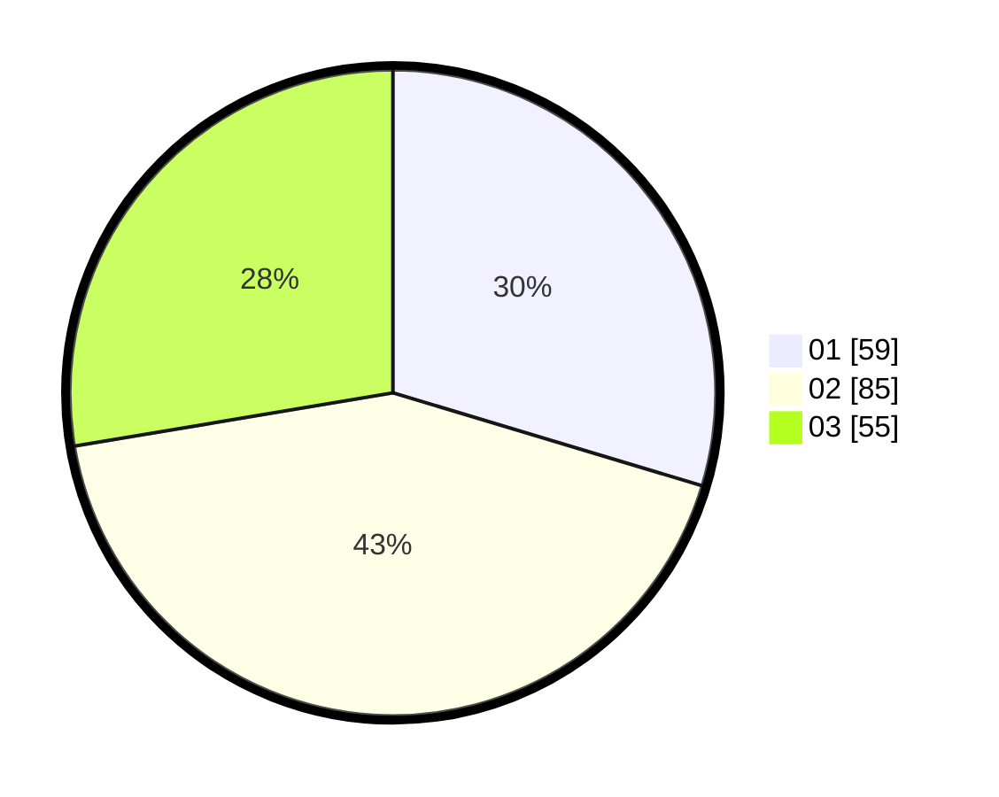

# Hasil

Hasil perolehan suara paslon dapat dilihat pada file paslon-01.txt, paslon-02.txt, dan paslon-03.txt.

Jika tidak ada, artinya data tersebut belum ada pada SIREKAP.

## Perolehan Suara

 * Paslon 01: **59**.
 * Paslon 02: **85**.
 * Paslon 03: **55**.

## Foto C Plano

https://sirekap-obj-formc.kpu.go.id/5d77/pemilu/ppwp/31/73/08/10/01/3173081001056-20240214-233622--020bd718-1834-449c-bfeb-138b94e34dc8.jpg

https://sirekap-obj-formc.kpu.go.id/5d77/pemilu/ppwp/31/73/08/10/01/3173081001056-20240214-234033--2cb06684-d3de-4874-b3ba-9218533ad44c.jpg

https://sirekap-obj-formc.kpu.go.id/5d77/pemilu/ppwp/31/73/08/10/01/3173081001056-20240214-233724--fa257fec-094d-40bc-9ae1-a80292d9d186.jpg
