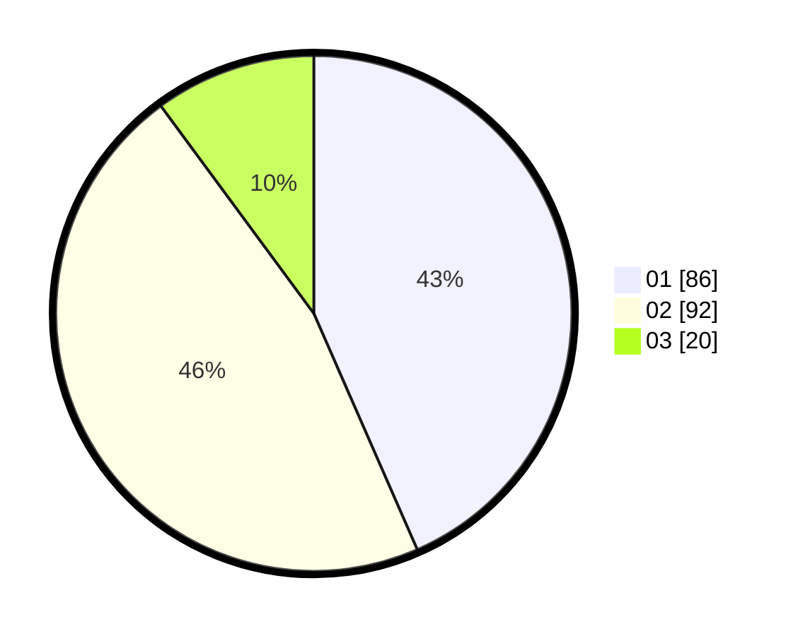

# Hasil

Hasil perolehan suara paslon dapat dilihat pada file paslon-01.txt, paslon-02.txt, dan paslon-03.txt.

Jika tidak ada, artinya data tersebut belum ada pada SIREKAP.

## Perolehan Suara

 * Paslon 01: **86**.
 * Paslon 02: **92**.
 * Paslon 03: **20**.

## Foto C Plano

https://sirekap-obj-formc.kpu.go.id/23e3/pemilu/ppwp/31/73/08/10/01/3173081001058-20240214-232759--9a793952-2f53-49cf-8bc0-26bf019ab729.jpg

https://sirekap-obj-formc.kpu.go.id/23e3/pemilu/ppwp/31/73/08/10/01/3173081001058-20240214-233045--9c921438-9b9c-415e-86a2-d393303d0619.jpg

https://sirekap-obj-formc.kpu.go.id/23e3/pemilu/ppwp/31/73/08/10/01/3173081001058-20240214-233208--e1d88e71-5ede-4e45-ad34-0a7ca8d4003e.jpg

## DATA PEMILIH TETAP

Jumlah pemilih dalam DPT: **285**.
 * L: **138**.
 * P: **147**.

## DATA PENGGUNA HAK PILIH

Jumlah pengguna hak pilih dalam DPT: **285**.
 * L: **138**.
 * P: **147**.

Jumlah pengguna hak pilih dalam DPTb: **0**.
 * L: **0**.
 * P: **0**.

Jumlah pengguna hak pilih dalam DPK: **0**.
 * L: **0**.
 * P: **0**.

Jumlah pengguna hak pilih: **201**.
 * L: **95**.
 * P: **106**.

## JUMLAH SUARA SAH DAN TIDAK SAH

JUMLAH SELURUH SUARA SAH: **198**.

JUMLAH SUARA TIDAK SAH: **3**.

JUMLAH SELURUH SUARA SAH DAN SUARA TIDAK SAH: **201**.
