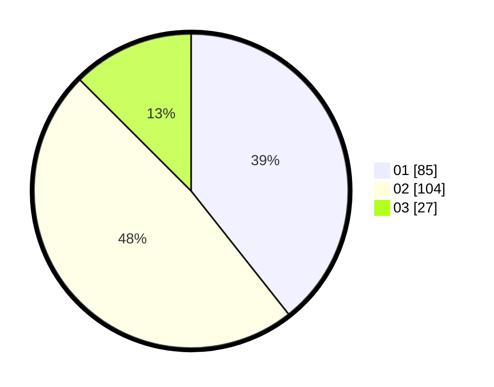

# Hasil

Hasil perolehan suara paslon dapat dilihat pada file paslon-01.txt, paslon-02.txt, dan paslon-03.txt.

Jika tidak ada, artinya data tersebut belum ada pada SIREKAP.

## Perolehan Suara

 * Paslon 01: **85**.
 * Paslon 02: **104**.
 * Paslon 03: **27**.

## Foto C Plano

https://sirekap-obj-formc.kpu.go.id/b35b/pemilu/ppwp/31/73/08/10/01/3173081001059-20240215-003022--70c6277a-d09e-43f1-ba5e-4bfa0b0d2333.jpg

https://sirekap-obj-formc.kpu.go.id/b35b/pemilu/ppwp/31/73/08/10/01/3173081001059-20240214-195003--5d77ff22-3529-4328-a37c-35dc6d5e7590.jpg

https://sirekap-obj-formc.kpu.go.id/b35b/pemilu/ppwp/31/73/08/10/01/3173081001059-20240214-195327--4f7db49f-a158-4d9f-b70d-5f71ad9a84da.jpg
