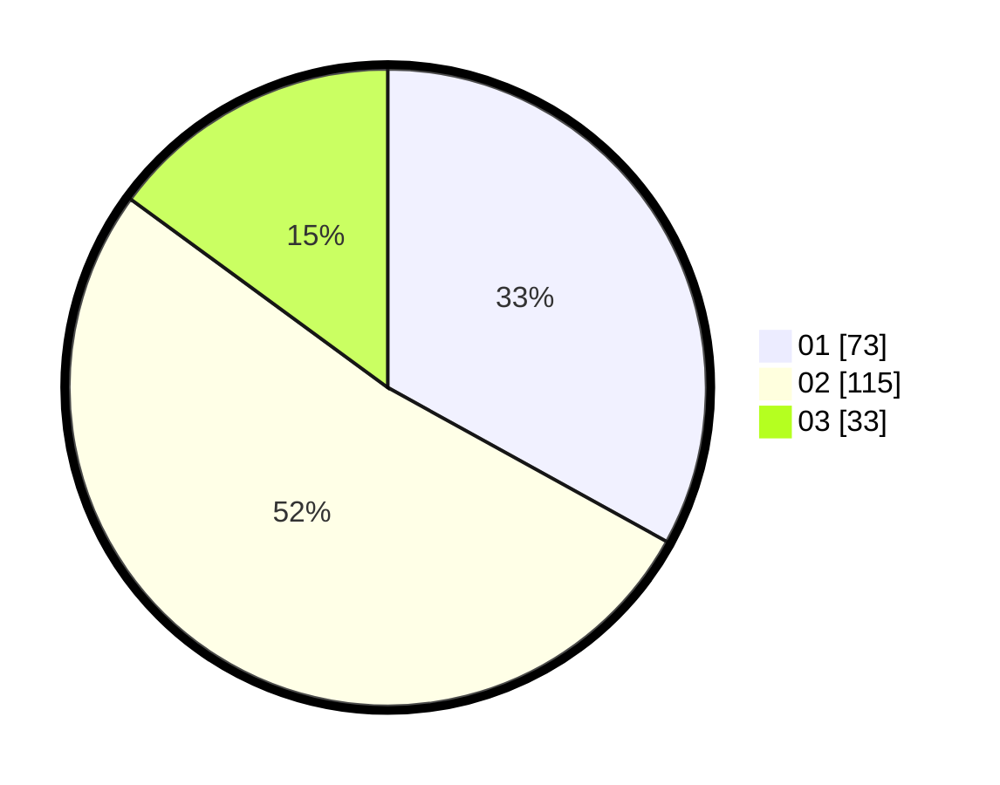

# Hasil

Hasil perolehan suara paslon dapat dilihat pada file paslon-01.txt, paslon-02.txt, dan paslon-03.txt.

Jika tidak ada, artinya data tersebut belum ada pada SIREKAP.

## Perolehan Suara

 * Paslon 01: **73**.
 * Paslon 02: **115**.
 * Paslon 03: **33**.

## Foto C Plano

https://sirekap-obj-formc.kpu.go.id/a7cc/pemilu/ppwp/31/73/08/10/01/3173081001060-20240214-232044--e12ad791-fbea-4882-b27f-c9790fe9ebd8.jpg

https://sirekap-obj-formc.kpu.go.id/a7cc/pemilu/ppwp/31/73/08/10/01/3173081001060-20240214-231949--26306e68-90ef-4f22-96e9-148daaf666d2.jpg

https://sirekap-obj-formc.kpu.go.id/a7cc/pemilu/ppwp/31/73/08/10/01/3173081001060-20240214-232215--e29b4f8d-231e-47bd-81bd-c58064cfdad8.jpg

## DATA PEMILIH TETAP

Jumlah pemilih dalam DPT: **289**.
 * L: **146**.
 * P: **143**.

## DATA PENGGUNA HAK PILIH

Jumlah pengguna hak pilih dalam DPT: **220**.
 * L: **110**.
 * P: **110**.

Jumlah pengguna hak pilih dalam DPTb: **5**.
 * L: **3**.
 * P: **2**.

Jumlah pengguna hak pilih dalam DPK: **0**.
 * L: **0**.
 * P: **0**.

Jumlah pengguna hak pilih: **225**.
 * L: **113**.
 * P: **112**.

## JUMLAH SUARA SAH DAN TIDAK SAH

JUMLAH SELURUH SUARA SAH: **221**.

JUMLAH SUARA TIDAK SAH: **4**.

JUMLAH SELURUH SUARA SAH DAN SUARA TIDAK SAH: **225**.
