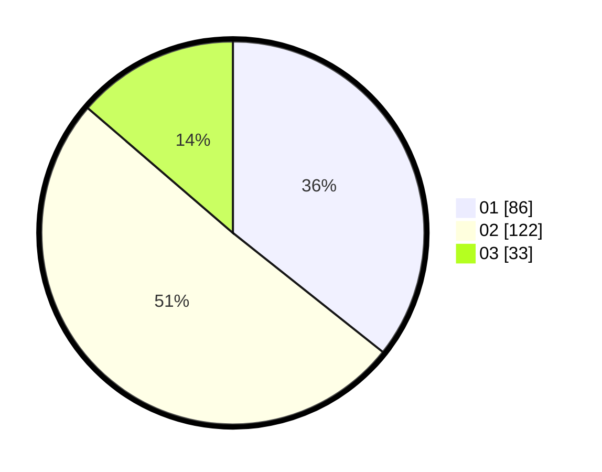

# Hasil

Hasil perolehan suara paslon dapat dilihat pada file paslon-01.txt, paslon-02.txt, dan paslon-03.txt.

Jika tidak ada, artinya data tersebut belum ada pada SIREKAP.

## Perolehan Suara

 * Paslon 01: **86**.
 * Paslon 02: **122**.
 * Paslon 03: **33**.

## Foto C Plano

https://sirekap-obj-formc.kpu.go.id/b3d6/pemilu/ppwp/31/73/08/10/01/3173081001066-20240214-193350--70d65d37-6eb7-4030-945e-fb9962d2bb74.jpg

https://sirekap-obj-formc.kpu.go.id/b3d6/pemilu/ppwp/31/73/08/10/01/3173081001066-20240214-190933--c600fa6d-3382-41b3-ad21-1e8983f75b0a.jpg

https://sirekap-obj-formc.kpu.go.id/b3d6/pemilu/ppwp/31/73/08/10/01/3173081001066-20240214-155801--e7488604-b8d6-4a41-8c70-aaae0fdbc0bb.jpg

## DATA PEMILIH TETAP

Jumlah pemilih dalam DPT: **286**.
 * L: **151**.
 * P: **135**.

## DATA PENGGUNA HAK PILIH

Jumlah pengguna hak pilih dalam DPT: **237**.
 * L: **119**.
 * P: **118**.

Jumlah pengguna hak pilih dalam DPTb: **2**.
 * L: **1**.
 * P: **1**.

Jumlah pengguna hak pilih dalam DPK: **2**.
 * L: **0**.
 * P: **2**.

Jumlah pengguna hak pilih: **241**.
 * L: **120**.
 * P: **121**.

## JUMLAH SUARA SAH DAN TIDAK SAH

JUMLAH SELURUH SUARA SAH: **241**.

JUMLAH SUARA TIDAK SAH: **3**.

JUMLAH SELURUH SUARA SAH DAN SUARA TIDAK SAH: **244**.
