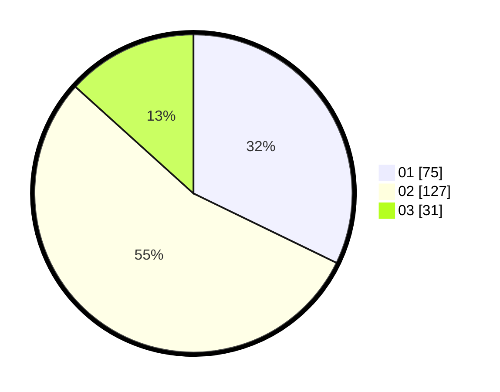

# Hasil

Hasil perolehan suara paslon dapat dilihat pada file paslon-01.txt, paslon-02.txt, dan paslon-03.txt.

Jika tidak ada, artinya data tersebut belum ada pada SIREKAP.

## Perolehan Suara

 * Paslon 01: **75**.
 * Paslon 02: **127**.
 * Paslon 03: **31**.

## Foto C Plano

https://sirekap-obj-formc.kpu.go.id/986e/pemilu/ppwp/31/73/08/10/01/3173081001067-20240216-065728--54576a7c-27ec-453b-a5aa-2f3bdeba8aa9.jpg

https://sirekap-obj-formc.kpu.go.id/986e/pemilu/ppwp/31/73/08/10/01/3173081001067-20240216-065730--1e1ec92f-4d2b-489c-aeb5-9797abfd2a14.jpg

https://sirekap-obj-formc.kpu.go.id/986e/pemilu/ppwp/31/73/08/10/01/3173081001067-20240216-065729--934f8bda-80b7-43fa-9697-67fd8b64dc69.jpg

## DATA PEMILIH TETAP

Jumlah pemilih dalam DPT: **285**.
 * L: **133**.
 * P: **152**.

## DATA PENGGUNA HAK PILIH

Jumlah pengguna hak pilih dalam DPT: **233**.
 * L: **103**.
 * P: **130**.

Jumlah pengguna hak pilih dalam DPTb: **2**.
 * L: **1**.
 * P: **1**.

Jumlah pengguna hak pilih dalam DPK: **1**.
 * L: **0**.
 * P: **1**.

Jumlah pengguna hak pilih: **236**.
 * L: **104**.
 * P: **132**.

## JUMLAH SUARA SAH DAN TIDAK SAH

JUMLAH SELURUH SUARA SAH: **233**.

JUMLAH SUARA TIDAK SAH: **3**.

JUMLAH SELURUH SUARA SAH DAN SUARA TIDAK SAH: **236**.
