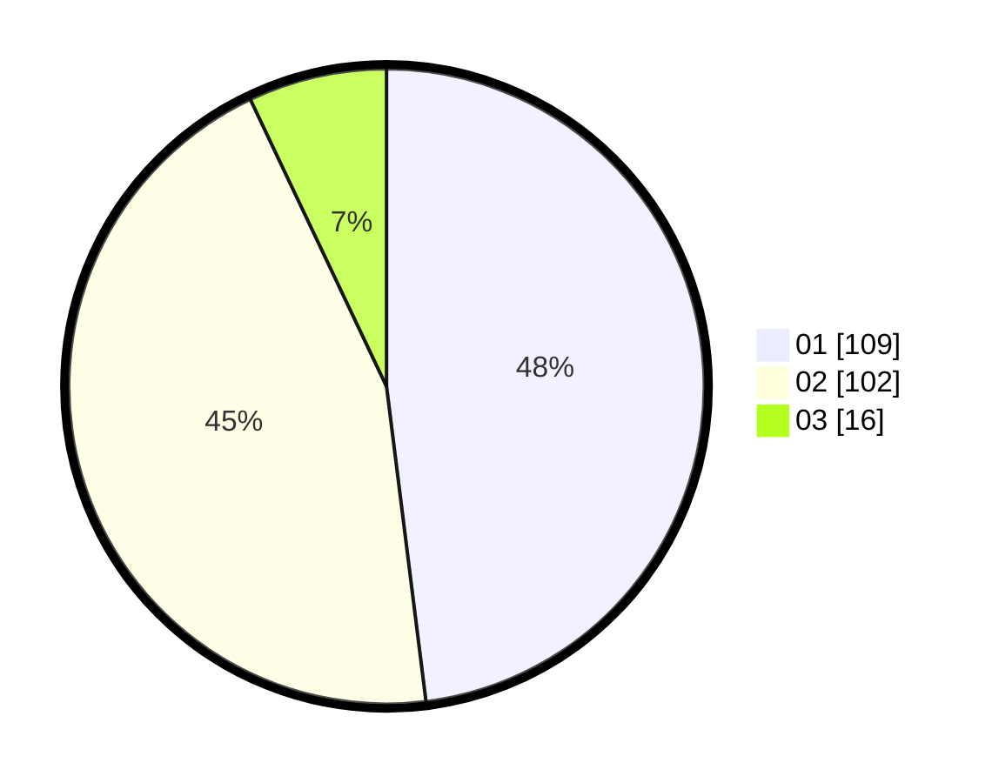

# Hasil

Hasil perolehan suara paslon dapat dilihat pada file paslon-01.txt, paslon-02.txt, dan paslon-03.txt.

Jika tidak ada, artinya data tersebut belum ada pada SIREKAP.

## Perolehan Suara

 * Paslon 01: **109**.
 * Paslon 02: **102**.
 * Paslon 03: **16**.

## Foto C Plano

https://sirekap-obj-formc.kpu.go.id/f215/pemilu/ppwp/31/73/08/10/01/3173081001073-20240215-224258--b9a49213-62b1-4f01-916a-127b12a5de0e.jpg

https://sirekap-obj-formc.kpu.go.id/f215/pemilu/ppwp/31/73/08/10/01/3173081001073-20240215-224259--34bd4656-9db7-4bf0-95f9-74312613d50d.jpg

https://sirekap-obj-formc.kpu.go.id/f215/pemilu/ppwp/31/73/08/10/01/3173081001073-20240215-224258--e353e21d-0050-4098-b2ec-0523d6d75938.jpg

## DATA PEMILIH TETAP

Jumlah pemilih dalam DPT: **288**.
 * L: **137**.
 * P: **151**.

## DATA PENGGUNA HAK PILIH

Jumlah pengguna hak pilih dalam DPT: **232**.
 * L: **108**.
 * P: **124**.

Jumlah pengguna hak pilih dalam DPTb: **1**.
 * L: **1**.
 * P: **0**.

Jumlah pengguna hak pilih dalam DPK: **0**.
 * L: **0**.
 * P: **0**.

Jumlah pengguna hak pilih: **233**.
 * L: **109**.
 * P: **124**.

## JUMLAH SUARA SAH DAN TIDAK SAH

JUMLAH SELURUH SUARA SAH: **227**.

JUMLAH SUARA TIDAK SAH: **6**.

JUMLAH SELURUH SUARA SAH DAN SUARA TIDAK SAH: **233**.
