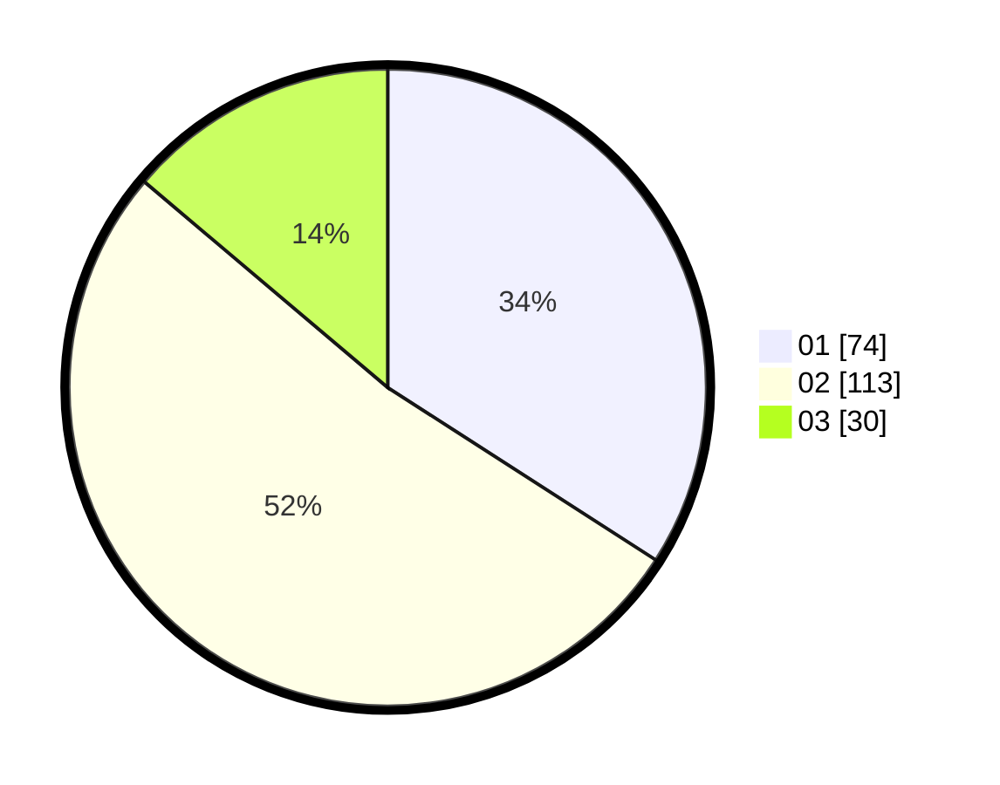

# Hasil

Hasil perolehan suara paslon dapat dilihat pada file paslon-01.txt, paslon-02.txt, dan paslon-03.txt.

Jika tidak ada, artinya data tersebut belum ada pada SIREKAP.

## Perolehan Suara

 * Paslon 01: **74**.
 * Paslon 02: **113**.
 * Paslon 03: **30**.

## Foto C Plano

https://sirekap-obj-formc.kpu.go.id/f14c/pemilu/ppwp/31/73/08/10/01/3173081001078-20240214-211608--dd55f12a-d9f3-4c22-ad52-c75ef10900b4.jpg

https://sirekap-obj-formc.kpu.go.id/f14c/pemilu/ppwp/31/73/08/10/01/3173081001078-20240214-155757--cd866d9a-0774-4474-8ef4-0554851b4ef4.jpg

https://sirekap-obj-formc.kpu.go.id/f14c/pemilu/ppwp/31/73/08/10/01/3173081001078-20240214-155814--0ccd90fc-ce5f-4557-b36f-66831f8fcde8.jpg
