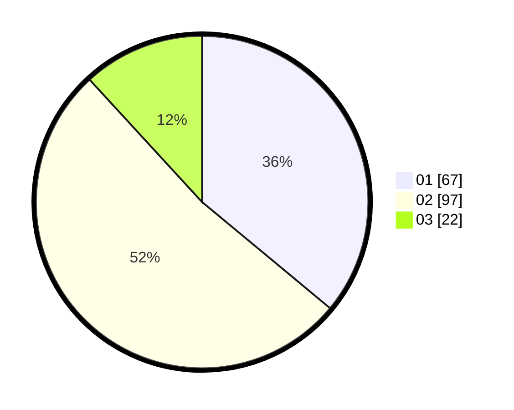

# Hasil

Hasil perolehan suara paslon dapat dilihat pada file paslon-01.txt, paslon-02.txt, dan paslon-03.txt.

Jika tidak ada, artinya data tersebut belum ada pada SIREKAP.

## Perolehan Suara

 * Paslon 01: **67**.
 * Paslon 02: **97**.
 * Paslon 03: **22**.

## Foto C Plano

https://sirekap-obj-formc.kpu.go.id/4d38/pemilu/ppwp/31/73/08/10/01/3173081001079-20240214-233036--5bc4b6cd-4543-4d73-99c3-374624364f94.jpg

https://sirekap-obj-formc.kpu.go.id/4d38/pemilu/ppwp/31/73/08/10/01/3173081001079-20240214-203813--a224571a-7357-4c78-ab0a-6dab02a70bf1.jpg

https://sirekap-obj-formc.kpu.go.id/4d38/pemilu/ppwp/31/73/08/10/01/3173081001079-20240214-203807--5626bd69-033f-4a81-b53b-d8f24b049373.jpg
