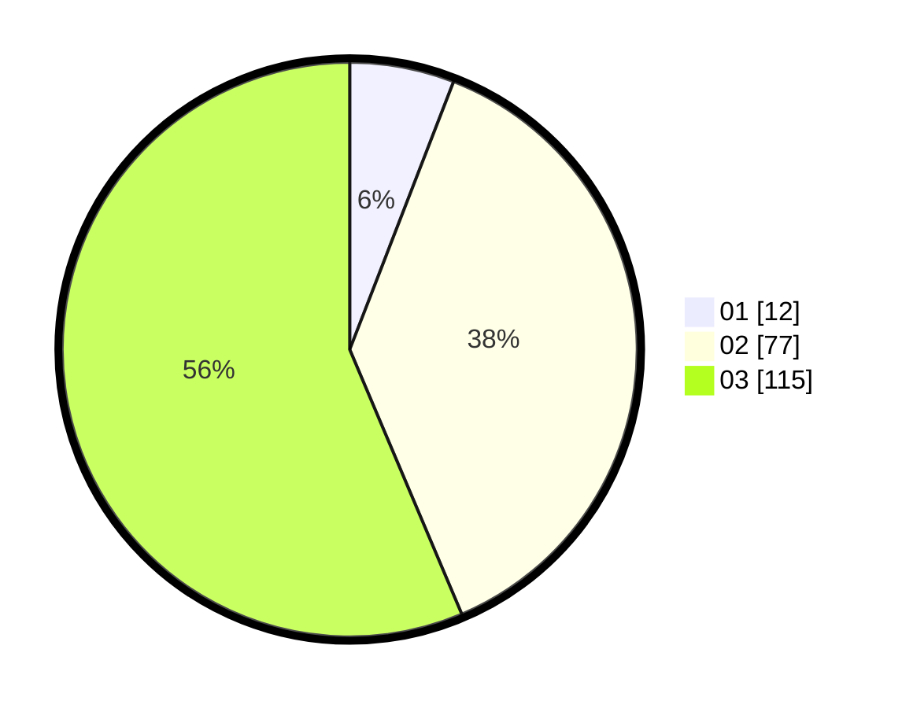

# Hasil

Hasil perolehan suara paslon dapat dilihat pada file paslon-01.txt, paslon-02.txt, dan paslon-03.txt.

Jika tidak ada, artinya data tersebut belum ada pada SIREKAP.

## Perolehan Suara

 * Paslon 01: **12**.
 * Paslon 02: **77**.
 * Paslon 03: **115**.

## Foto C Plano

https://sirekap-obj-formc.kpu.go.id/0712/pemilu/ppwp/31/73/08/10/01/3173081001081-20240214-155352--6d7f8f94-e545-441f-916f-3a42a1e3c57a.jpg

https://sirekap-obj-formc.kpu.go.id/0712/pemilu/ppwp/31/73/08/10/01/3173081001081-20240214-155420--4679bede-23eb-49f5-9bd3-e579884ba8a3.jpg

https://sirekap-obj-formc.kpu.go.id/0712/pemilu/ppwp/31/73/08/10/01/3173081001081-20240214-155440--e321ec05-dfb7-417e-9495-08736fe2e606.jpg
