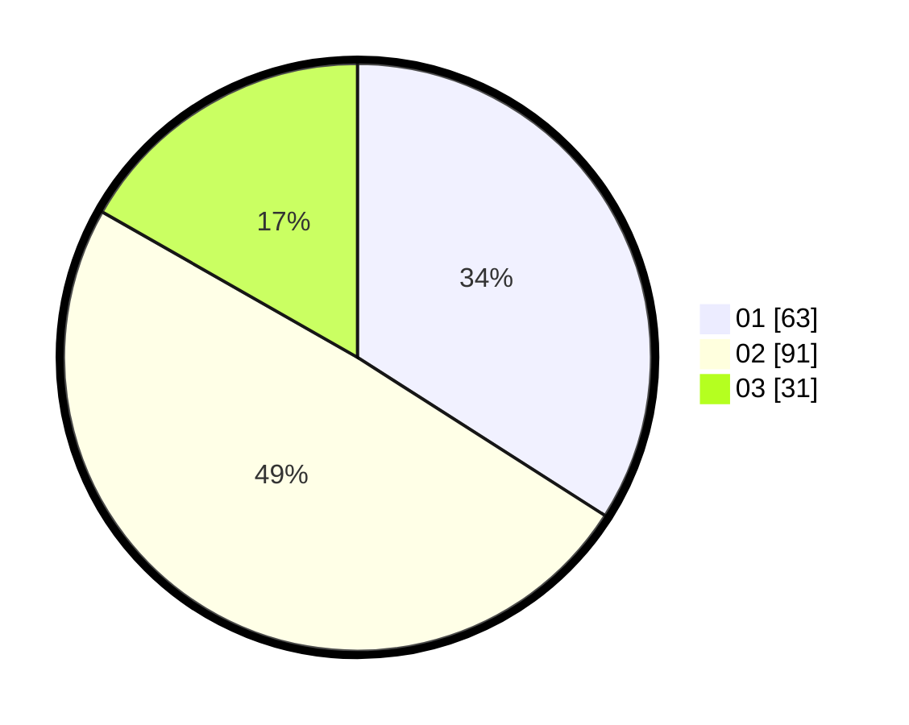

# Hasil

Hasil perolehan suara paslon dapat dilihat pada file paslon-01.txt, paslon-02.txt, dan paslon-03.txt.

Jika tidak ada, artinya data tersebut belum ada pada SIREKAP.

## Perolehan Suara

 * Paslon 01: **63**.
 * Paslon 02: **91**.
 * Paslon 03: **31**.

## Foto C Plano

https://sirekap-obj-formc.kpu.go.id/c2c3/pemilu/ppwp/31/73/08/10/01/3173081001089-20240214-184545--256b3c26-ad4b-4619-9ab6-266f4cda6895.jpg

https://sirekap-obj-formc.kpu.go.id/c2c3/pemilu/ppwp/31/73/08/10/01/3173081001089-20240214-184614--f95274aa-f61a-4078-8eab-7dc7250c3e3a.jpg

https://sirekap-obj-formc.kpu.go.id/c2c3/pemilu/ppwp/31/73/08/10/01/3173081001089-20240214-184624--0872dcce-2099-4d80-b558-2f7ed890f7b1.jpg

## DATA PEMILIH TETAP

Jumlah pemilih dalam DPT: **262**.
 * L: **132**.
 * P: **130**.

## DATA PENGGUNA HAK PILIH

Jumlah pengguna hak pilih dalam DPT: **179**.
 * L: **84**.
 * P: **95**.

Jumlah pengguna hak pilih dalam DPTb: **0**.
 * L: **0**.
 * P: **0**.

Jumlah pengguna hak pilih dalam DPK: **10**.
 * L: **4**.
 * P: **6**.

Jumlah pengguna hak pilih: **189**.
 * L: **88**.
 * P: **101**.

## JUMLAH SUARA SAH DAN TIDAK SAH

JUMLAH SELURUH SUARA SAH: **185**.

JUMLAH SUARA TIDAK SAH: **4**.

JUMLAH SELURUH SUARA SAH DAN SUARA TIDAK SAH: **189**.
