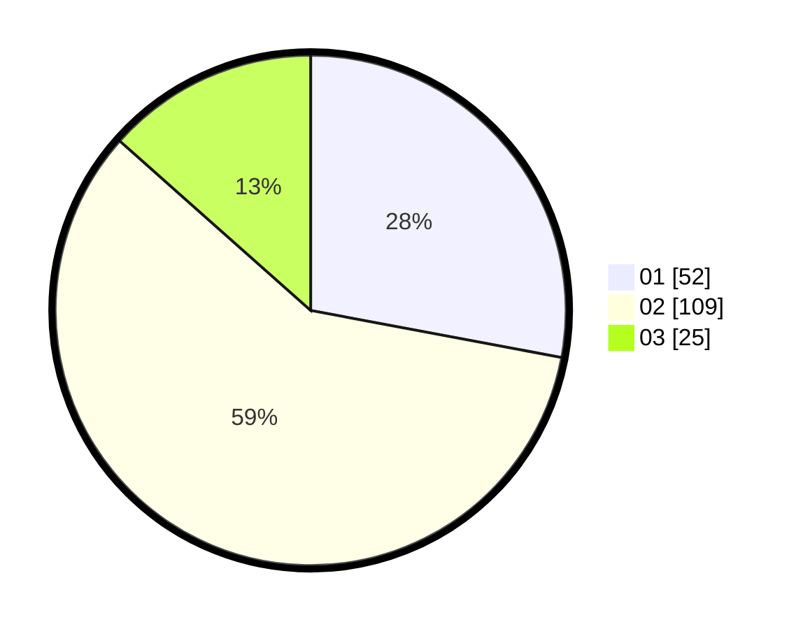

# Hasil

Hasil perolehan suara paslon dapat dilihat pada file paslon-01.txt, paslon-02.txt, dan paslon-03.txt.

Jika tidak ada, artinya data tersebut belum ada pada SIREKAP.

## Perolehan Suara

 * Paslon 01: **52**.
 * Paslon 02: **109**.
 * Paslon 03: **25**.

## Foto C Plano

https://sirekap-obj-formc.kpu.go.id/8e2c/pemilu/ppwp/31/73/08/10/01/3173081001091-20240214-202831--e34dc2a7-c0c0-498e-9cf6-c06605c11ef0.jpg

https://sirekap-obj-formc.kpu.go.id/8e2c/pemilu/ppwp/31/73/08/10/01/3173081001091-20240214-203145--07f6d7cd-e318-4a31-91b6-44853417bf32.jpg

https://sirekap-obj-formc.kpu.go.id/8e2c/pemilu/ppwp/31/73/08/10/01/3173081001091-20240214-214848--1d76b350-5f1c-4a3c-b641-b6819a744a96.jpg
