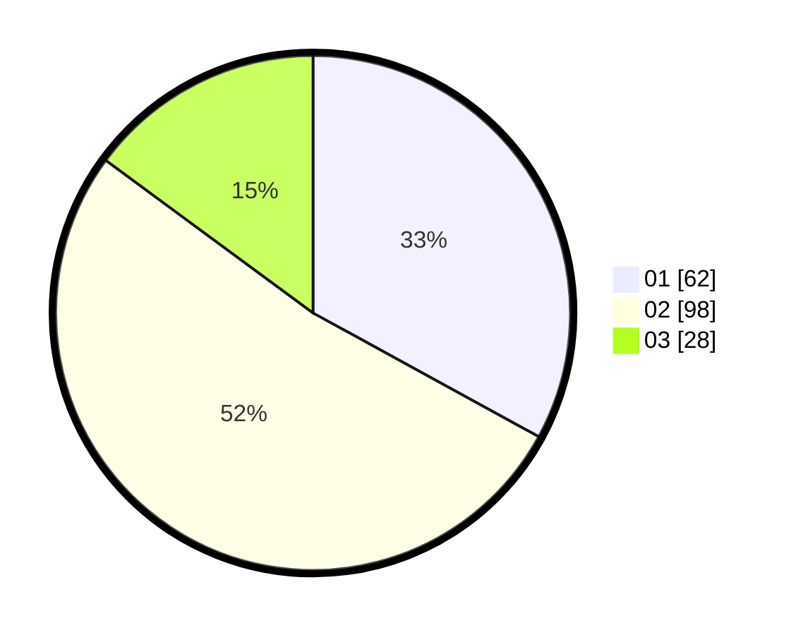

# Hasil

Hasil perolehan suara paslon dapat dilihat pada file paslon-01.txt, paslon-02.txt, dan paslon-03.txt.

Jika tidak ada, artinya data tersebut belum ada pada SIREKAP.

## Perolehan Suara

 * Paslon 01: **62**.
 * Paslon 02: **98**.
 * Paslon 03: **28**.

## Foto C Plano

https://sirekap-obj-formc.kpu.go.id/287a/pemilu/ppwp/31/73/08/10/01/3173081001093-20240214-194550--da863bb4-8890-4efa-a705-ccf1a7111ede.jpg

https://sirekap-obj-formc.kpu.go.id/287a/pemilu/ppwp/31/73/08/10/01/3173081001093-20240214-194659--9c6b7e3a-d644-4dea-b27d-992af82476dd.jpg

https://sirekap-obj-formc.kpu.go.id/287a/pemilu/ppwp/31/73/08/10/01/3173081001093-20240214-194758--0e3ac31e-78fb-4f89-9a4f-767b383bbaaa.jpg

## DATA PEMILIH TETAP

Jumlah pemilih dalam DPT: **231**.
 * L: **111**.
 * P: **120**.

## DATA PENGGUNA HAK PILIH

Jumlah pengguna hak pilih dalam DPT: **191**.
 * L: **92**.
 * P: **99**.

Jumlah pengguna hak pilih dalam DPTb: **0**.
 * L: **0**.
 * P: **0**.

Jumlah pengguna hak pilih dalam DPK: **0**.
 * L: **0**.
 * P: **0**.

Jumlah pengguna hak pilih: **191**.
 * L: **92**.
 * P: **99**.

## JUMLAH SUARA SAH DAN TIDAK SAH

JUMLAH SELURUH SUARA SAH: **188**.

JUMLAH SUARA TIDAK SAH: **3**.

JUMLAH SELURUH SUARA SAH DAN SUARA TIDAK SAH: **191**.
