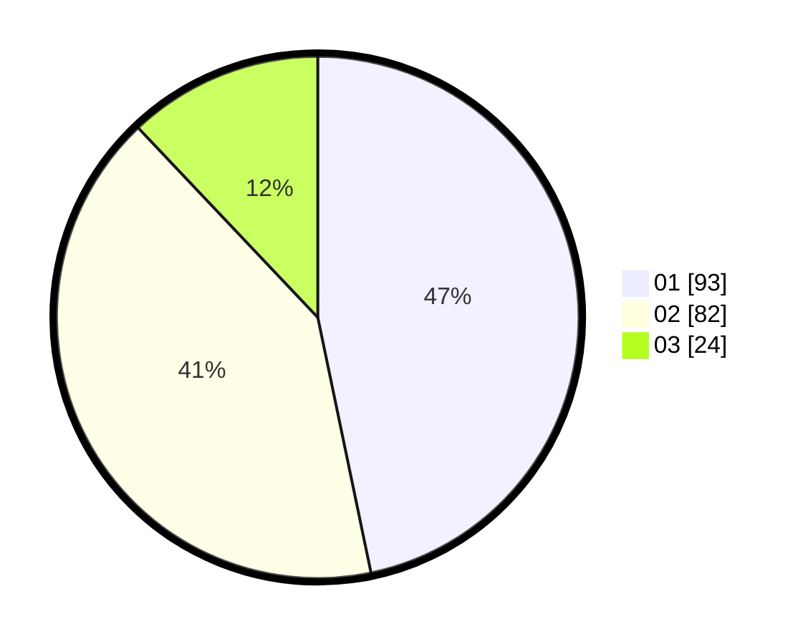

# Hasil

Hasil perolehan suara paslon dapat dilihat pada file paslon-01.txt, paslon-02.txt, dan paslon-03.txt.

Jika tidak ada, artinya data tersebut belum ada pada SIREKAP.

## Perolehan Suara

 * Paslon 01: **93**.
 * Paslon 02: **82**.
 * Paslon 03: **24**.

## Foto C Plano

https://sirekap-obj-formc.kpu.go.id/34f5/pemilu/ppwp/31/73/08/10/01/3173081001103-20240214-231311--fde99c3a-a03c-40ed-a873-2bca00979c9a.jpg

https://sirekap-obj-formc.kpu.go.id/34f5/pemilu/ppwp/31/73/08/10/01/3173081001103-20240214-231332--1cfb7ffb-021a-4258-8aae-33a950b30f66.jpg

https://sirekap-obj-formc.kpu.go.id/34f5/pemilu/ppwp/31/73/08/10/01/3173081001103-20240214-231357--c8ba5230-2a76-4863-98e9-02f402993fc7.jpg
