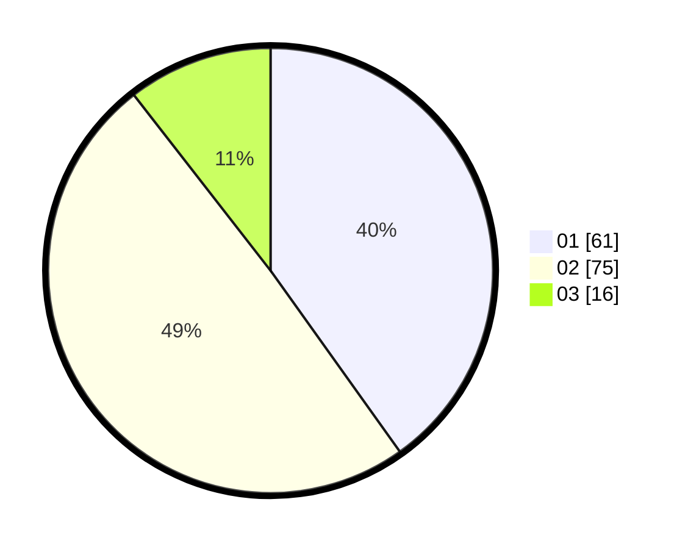

# Hasil

Hasil perolehan suara paslon dapat dilihat pada file paslon-01.txt, paslon-02.txt, dan paslon-03.txt.

Jika tidak ada, artinya data tersebut belum ada pada SIREKAP.

## Perolehan Suara

 * Paslon 01: **61**.
 * Paslon 02: **75**.
 * Paslon 03: **16**.

## Foto C Plano

https://sirekap-obj-formc.kpu.go.id/cdd1/pemilu/ppwp/31/73/08/10/01/3173081001106-20240214-215837--c8833546-2c53-4b46-8a08-447f5709a4fd.jpg

https://sirekap-obj-formc.kpu.go.id/cdd1/pemilu/ppwp/31/73/08/10/01/3173081001106-20240214-220107--fc6f4b92-6f58-4e09-a202-a35770d0f371.jpg

https://sirekap-obj-formc.kpu.go.id/cdd1/pemilu/ppwp/31/73/08/10/01/3173081001106-20240214-220338--380f3126-414c-4953-a721-40af29128f7e.jpg
