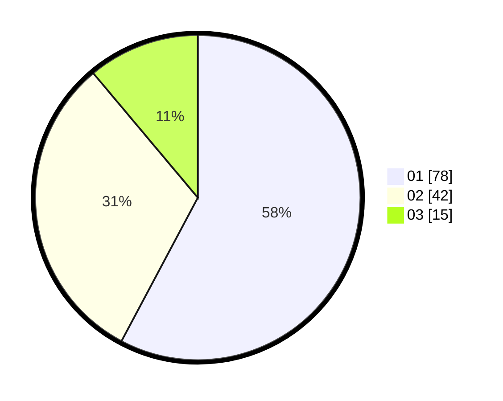

# Hasil

Hasil perolehan suara paslon dapat dilihat pada file paslon-01.txt, paslon-02.txt, dan paslon-03.txt.

Jika tidak ada, artinya data tersebut belum ada pada SIREKAP.

## Perolehan Suara

 * Paslon 01: **78**.
 * Paslon 02: **42**.
 * Paslon 03: **15**.

## Foto C Plano

https://sirekap-obj-formc.kpu.go.id/0964/pemilu/ppwp/31/73/08/10/01/3173081001118-20240214-214922--15ef0352-6501-43c1-a1ac-9928f9f4e30b.jpg

https://sirekap-obj-formc.kpu.go.id/0964/pemilu/ppwp/31/73/08/10/01/3173081001118-20240214-215234--bd004735-7a2e-401e-b54e-737fd2da0654.jpg

https://sirekap-obj-formc.kpu.go.id/0964/pemilu/ppwp/31/73/08/10/01/3173081001118-20240214-215422--f11e2156-22eb-4e34-88a7-7ab046129c58.jpg
