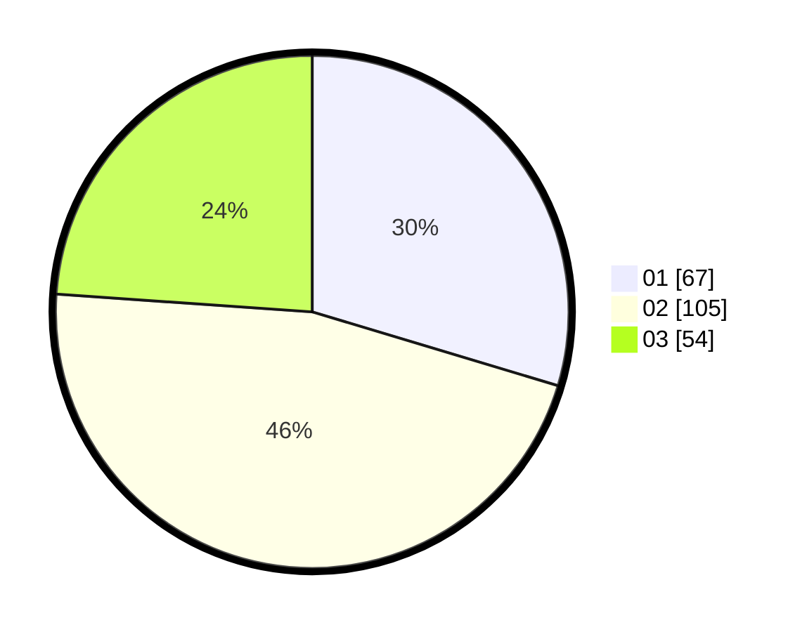

# Hasil

Hasil perolehan suara paslon dapat dilihat pada file paslon-01.txt, paslon-02.txt, dan paslon-03.txt.

Jika tidak ada, artinya data tersebut belum ada pada SIREKAP.

## Perolehan Suara

 * Paslon 01: **67**.
 * Paslon 02: **105**.
 * Paslon 03: **54**.

## Foto C Plano

https://sirekap-obj-formc.kpu.go.id/296e/pemilu/ppwp/31/73/08/10/01/3173081001127-20240216-141744--b2b7c9ed-e8fa-4051-805e-8a31e416919e.jpg

https://sirekap-obj-formc.kpu.go.id/296e/pemilu/ppwp/31/73/08/10/01/3173081001127-20240216-141745--5f1d72f0-0650-4ae7-9652-66bfcacf25a4.jpg

https://sirekap-obj-formc.kpu.go.id/296e/pemilu/ppwp/31/73/08/10/01/3173081001127-20240216-141744--686a420c-ad87-4658-b4b0-5ab53e8f2e4c.jpg

## DATA PEMILIH TETAP

Jumlah pemilih dalam DPT: **271**.
 * L: **139**.
 * P: **132**.

## DATA PENGGUNA HAK PILIH

Jumlah pengguna hak pilih dalam DPT: **228**.
 * L: **114**.
 * P: **114**.

Jumlah pengguna hak pilih dalam DPTb: **0**.
 * L: **0**.
 * P: **0**.

Jumlah pengguna hak pilih dalam DPK: **0**.
 * L: **0**.
 * P: **0**.

Jumlah pengguna hak pilih: **228**.
 * L: **114**.
 * P: **114**.

## JUMLAH SUARA SAH DAN TIDAK SAH

JUMLAH SELURUH SUARA SAH: **226**.

JUMLAH SUARA TIDAK SAH: **2**.

JUMLAH SELURUH SUARA SAH DAN SUARA TIDAK SAH: **228**.
