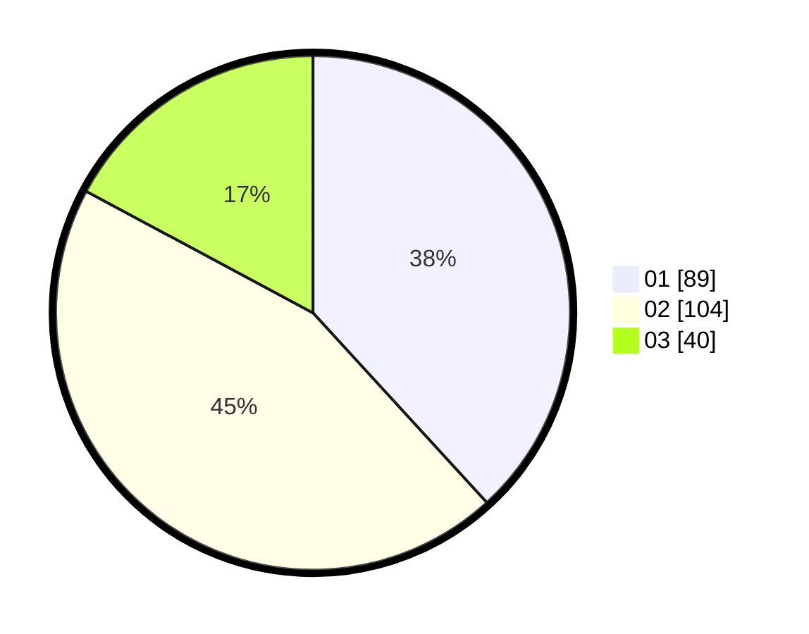

# Hasil

Hasil perolehan suara paslon dapat dilihat pada file paslon-01.txt, paslon-02.txt, dan paslon-03.txt.

Jika tidak ada, artinya data tersebut belum ada pada SIREKAP.

## Perolehan Suara

 * Paslon 01: **89**.
 * Paslon 02: **104**.
 * Paslon 03: **40**.

## Foto C Plano

https://sirekap-obj-formc.kpu.go.id/8f6d/pemilu/ppwp/31/73/08/10/01/3173081001128-20240214-184920--44edd839-74db-4602-ba1d-a2ab4a480821.jpg

https://sirekap-obj-formc.kpu.go.id/8f6d/pemilu/ppwp/31/73/08/10/01/3173081001128-20240214-185052--d36fc885-714d-4462-bfca-1f52212e9b44.jpg

https://sirekap-obj-formc.kpu.go.id/8f6d/pemilu/ppwp/31/73/08/10/01/3173081001128-20240214-185112--0424c15e-a5fb-4aa9-9aba-24210fcb3a27.jpg

## DATA PEMILIH TETAP

Jumlah pemilih dalam DPT: **271**.
 * L: **144**.
 * P: **127**.

## DATA PENGGUNA HAK PILIH

Jumlah pengguna hak pilih dalam DPT: **232**.
 * L: **127**.
 * P: **105**.

Jumlah pengguna hak pilih dalam DPTb: **1**.
 * L: **0**.
 * P: **1**.

Jumlah pengguna hak pilih dalam DPK: **4**.
 * L: **1**.
 * P: **3**.

Jumlah pengguna hak pilih: **237**.
 * L: **128**.
 * P: **109**.

## JUMLAH SUARA SAH DAN TIDAK SAH

JUMLAH SELURUH SUARA SAH: **233**.

JUMLAH SUARA TIDAK SAH: **4**.

JUMLAH SELURUH SUARA SAH DAN SUARA TIDAK SAH: **237**.
