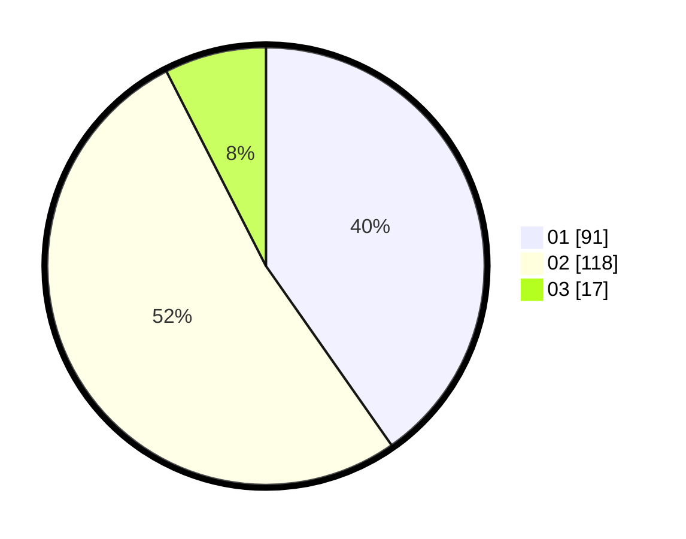

# Hasil

Hasil perolehan suara paslon dapat dilihat pada file paslon-01.txt, paslon-02.txt, dan paslon-03.txt.

Jika tidak ada, artinya data tersebut belum ada pada SIREKAP.

## Perolehan Suara

 * Paslon 01: **91**.
 * Paslon 02: **118**.
 * Paslon 03: **17**.

## Foto C Plano

https://sirekap-obj-formc.kpu.go.id/0b34/pemilu/ppwp/31/73/08/10/01/3173081001132-20240214-225141--77258322-c725-47b3-aee2-bd8682ecec55.jpg

https://sirekap-obj-formc.kpu.go.id/0b34/pemilu/ppwp/31/73/08/10/01/3173081001132-20240214-225252--b108b032-6e0b-4352-909a-402d5da86356.jpg

https://sirekap-obj-formc.kpu.go.id/0b34/pemilu/ppwp/31/73/08/10/01/3173081001132-20240214-225412--15bee19c-e54a-4d97-b2f8-94cf6d0e5be7.jpg
