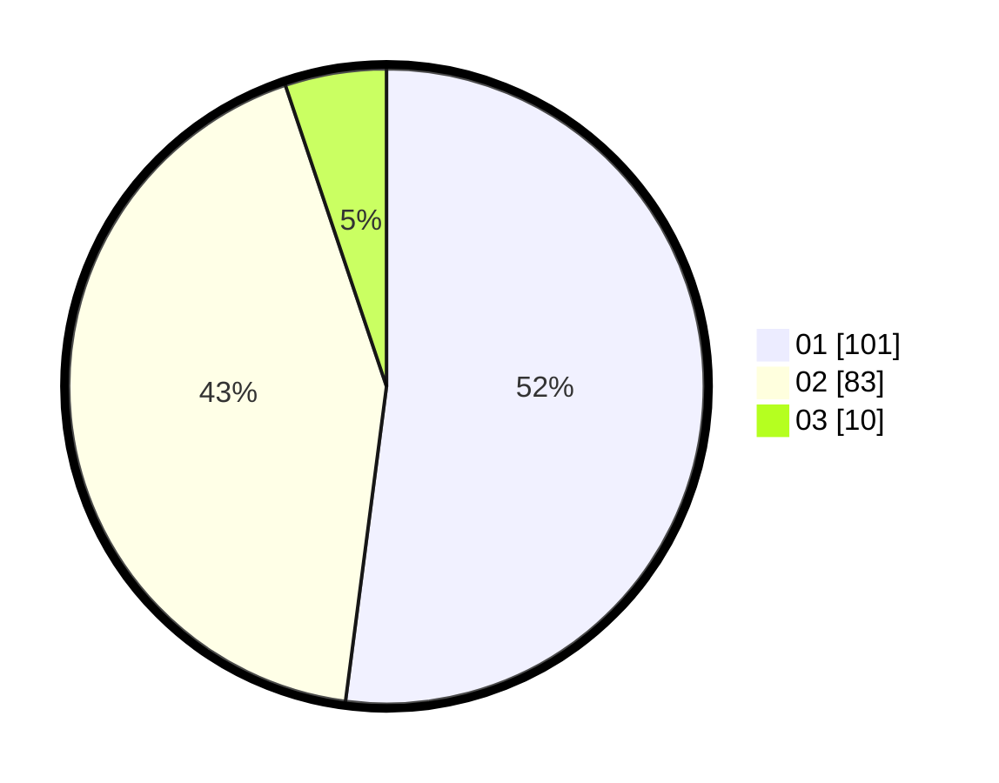

# Hasil

Hasil perolehan suara paslon dapat dilihat pada file paslon-01.txt, paslon-02.txt, dan paslon-03.txt.

Jika tidak ada, artinya data tersebut belum ada pada SIREKAP.

## Perolehan Suara

 * Paslon 01: **101**.
 * Paslon 02: **83**.
 * Paslon 03: **10**.

## Foto C Plano

https://sirekap-obj-formc.kpu.go.id/36ec/pemilu/ppwp/31/73/08/10/01/3173081001136-20240215-032331--881d6f10-93ba-47fd-9670-8f0612ca9ba0.jpg

https://sirekap-obj-formc.kpu.go.id/36ec/pemilu/ppwp/31/73/08/10/01/3173081001136-20240214-231910--8b94f9d9-f4d1-426b-8943-dc61b3e286ce.jpg

https://sirekap-obj-formc.kpu.go.id/36ec/pemilu/ppwp/31/73/08/10/01/3173081001136-20240214-232025--9a041b75-37ac-46d3-8da4-fc8efd267dfd.jpg

## DATA PEMILIH TETAP

Jumlah pemilih dalam DPT: **225**.
 * L: **105**.
 * P: **120**.

## DATA PENGGUNA HAK PILIH

Jumlah pengguna hak pilih dalam DPT: **194**.
 * L: **84**.
 * P: **110**.

Jumlah pengguna hak pilih dalam DPTb: **10**.
 * L: **0**.
 * P: **10**.

Jumlah pengguna hak pilih dalam DPK: **2**.
 * L: **1**.
 * P: **1**.

Jumlah pengguna hak pilih: **206**.
 * L: **85**.
 * P: **121**.

## JUMLAH SUARA SAH DAN TIDAK SAH

JUMLAH SELURUH SUARA SAH: **194**.

JUMLAH SUARA TIDAK SAH: **1**.

JUMLAH SELURUH SUARA SAH DAN SUARA TIDAK SAH: **195**.
